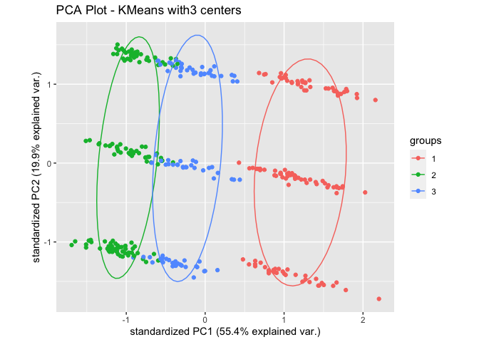
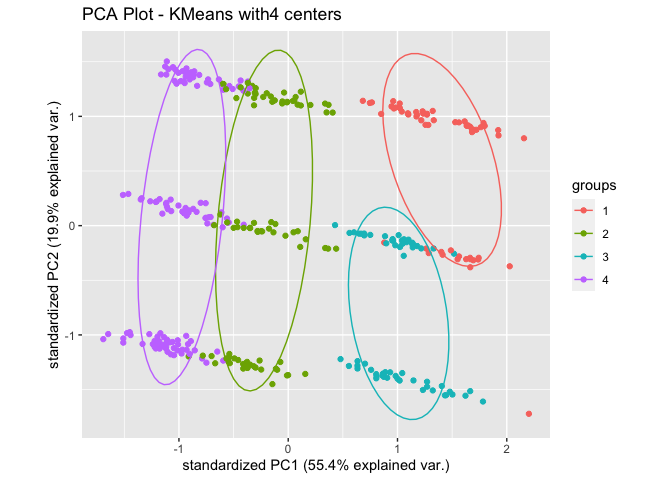
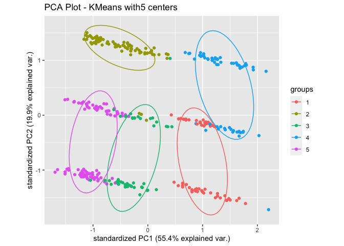
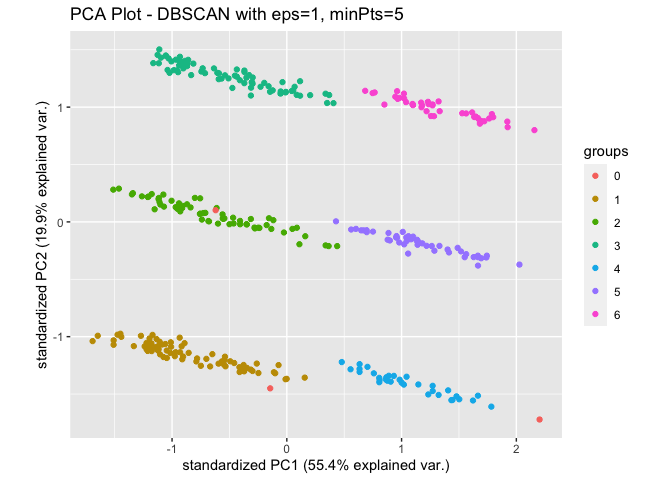
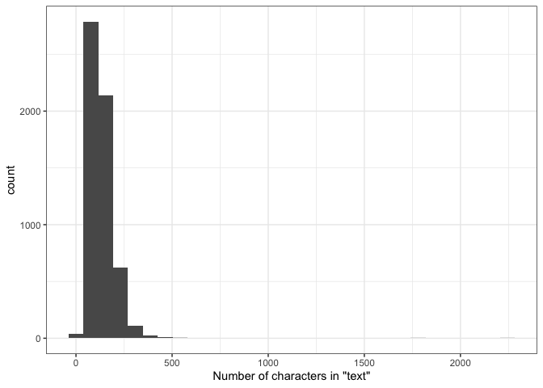
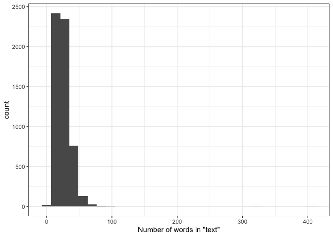
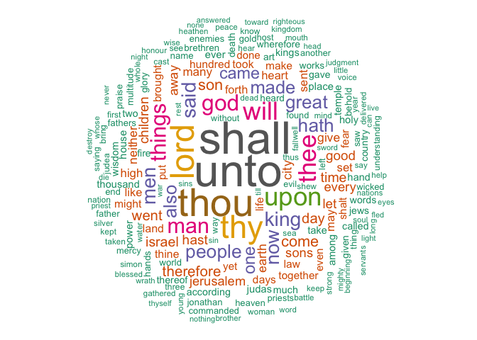
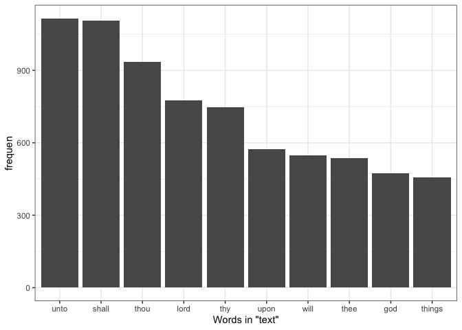
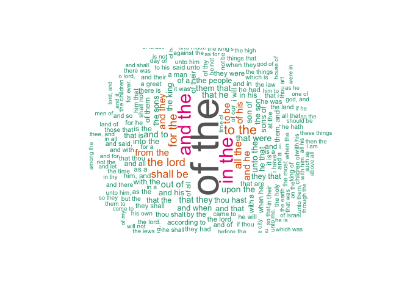
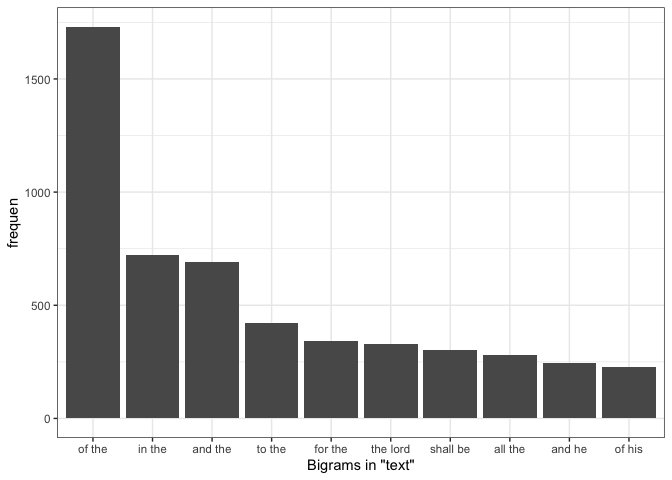

<!-- README.md is generated from README.Rmd. Please edit that file -->

datascience.eda
===============

<!-- badges: start -->
<!-- badges: end -->

This package includes functions assisting data scientists with various
common tasks during the exploratory data analysis stage of a data
science project. Its functions will help the data scientist to do
preliminary analysis on common column types like numeric columns,
categorical columns and text columns; it will also conduct several
experimental clusterings on the dataset.

Our functions are tailored based on our own experience, there are also
similar packages published, a few good ones worth mentioning:

-   [EDA](https://cran.r-project.org/web/packages/dlookr/vignettes/EDA.html)
-   [SmartEDA](https://cran.r-project.org/web/packages/SmartEDA/vignettes/SmartEDA.html)
-   [DataExplorer](https://github.com/boxuancui/DataExplorer)

Main functions
--------------

-   `explore_numeric_columns`: conducts common exploratory analysis on
    columns with numeric type: it generates a heatmap showing
    correlation coefficients (using `pearson`, `kendall` or `spearman`
    correlation on choice), histograms and SPLOM plots for all numeric
    columns or a list of columns specified by the user. This returns a
    list of plot objects so that the user can save and use them later
    on.

-   `explore_categorical_columns`: performs exploratory analysis on
    categorical features. It returns a list having a tibble with column
    names, corresponding unique categories, counts of null values,
    percentages of null values and most frequent categories along with
    bar plots of user provided categorical columns.

-   `explore_text_columns`: performs exploratory data analysis of text
    features. If text feature columns are not specified, the function
    will try to identify the text features. The function prints the
    summary statistics of character length and word count, and plots a
    histogram of its distributions. It also plots the word cloud of
    words (after removing stopwords) and bi-grams. Bar charts of top 10
    words (after removing stopwords) and top 10 bi-grams will be plotted
    as well. This function returns a list of all the results.

-   `explore_clustering`: fits K-Means and DBSCAN clustering algorithms
    on the dataset and visualizes the clustering using scatterplots on
    PCA transformed data. It returns a dictionary (list) with each key
    being name of the clustering algorithm and the value being a list of
    plots generated by the models.

-   `explore_KMeans_clustering`: fits K-Means clustering algorithms on
    the dataset and visualizes the clustering using scatterplots on PCA
    transformed data. It returns a list of plots.

-   `explore_DBSCAN_clustering`: fits K-DBSCAN clustering algorithms on
    the dataset and visualizes the clustering using scatterplots on PCA
    transformed data. It returns a list of plots.

Installation
------------

You can install the development version of datascience.eda with:

    # install.packages("devtools")
    devtools::install_github("UBC-MDS/datascience.eda.R")

Example
-------

    library(datascience.eda)
    library(palmerpenguins)

    # you can call each clustering algorithm separately 
    explore_KMeans_clustering(penguins, centers = seq(3, 5))
    #> Warning: did not converge in 10 iterations
    #> [[1]]

    #> 
    #> [[2]]

    #> 
    #> [[3]]

    explore_DBSCAN_clustering(penguins, eps = c(1), minPts = c(5))
    #> [[1]]

    # OR you can just call explore_clustering(penguins) to apply both KMeans and DBSCAN at once

    # example for `explore_text_columns`
    library(sacred)
    results <- explore_text_columns(apocrypha)

Identified the following as text columns: text

Exploratory Data Analysis of “text” column:
-------------------------------------------

### Character Length:

-   The average character length of text is: 131.42

-   The median character length of text is: 118

-   The longest text(s) has 2257 characters:

“O Lord, Almighty God of our fathers, Abraham, Isaac, and Jacob, and of
their righteous seed; who hast made heaven and earth, with all the
ornament thereof; who hast bound the sea by the word of thy commandment;
who hast shut up the deep, and sealed it by thy terrible and glorious
name; whom all men fear, and tremble before thy power; for the majesty
of thy glory cannot be borne, and thine angry threatening toward sinners
is importable: but thy merciful promise is unmeasurable and
unsearchable; for thou art the most high Lord, of great compassion,
longsuffering, very merciful, and repentest of the evils of men. Thou, O
Lord, according to thy great goodness hast promised repentance and
forgiveness to them that have sinned against thee: and of thine infinite
mercies hast appointed repentance unto sinners, that they may be saved.
Thou therefore, O Lord, that art the God of the just, hast not appointed
repentance to the just, as to Abraham, and Isaac, and Jacob, which have
not sinned against thee; but thou hast appointed repentance unto me that
am a sinner: for I have sinned above the number of the sands of the sea.
My transgressions, O Lord, are multiplied: my transgressions are
multiplied, and I am not worthy to behold and see the height of heaven
for the multitude of mine iniquities. I am bowed down with many iron
bands, that I cannot life up mine head, neither have any release: for I
have provoked thy wrath, and done evil before thee: I did not thy will,
neither kept I thy commandments: I have set up abominations, and have
multiplied offences. Now therefore I bow the knee of mine heart,
beseeching thee of grace. I have sinned, O Lord, I have sinned, and I
acknowledge mine iniquities: wherefore, I humbly beseech thee, forgive
me, O Lord, forgive me, and destroy me not with mine iniquites. Be not
angry with me for ever, by reserving evil for me; neither condemn me to
the lower parts of the earth. For thou art the God, even the God of them
that repent; and in me thou wilt shew all thy goodness: for thou wilt
save me, that am unworthy, according to thy great mercy. Therefore I
will praise thee for ever all the days of my life: for all the powers of
the heavens do praise thee, and thine is the glory for ever and ever.
Amen.”

-   The shortest text(s) has 13 characters:

“And I did so.”

#### Histogram of number of characters in “text”:

### Word Count:

-   The average number of words in “text” is: 24.73

-   The median number of words in “text” is: 22

-   The text(s) in “text” with most words (408 words):

“O Lord, Almighty God of our fathers, Abraham, Isaac, and Jacob, and of
their righteous seed; who hast made heaven and earth, with all the
ornament thereof; who hast bound the sea by the word of thy commandment;
who hast shut up the deep, and sealed it by thy terrible and glorious
name; whom all men fear, and tremble before thy power; for the majesty
of thy glory cannot be borne, and thine angry threatening toward sinners
is importable: but thy merciful promise is unmeasurable and
unsearchable; for thou art the most high Lord, of great compassion,
longsuffering, very merciful, and repentest of the evils of men. Thou, O
Lord, according to thy great goodness hast promised repentance and
forgiveness to them that have sinned against thee: and of thine infinite
mercies hast appointed repentance unto sinners, that they may be saved.
Thou therefore, O Lord, that art the God of the just, hast not appointed
repentance to the just, as to Abraham, and Isaac, and Jacob, which have
not sinned against thee; but thou hast appointed repentance unto me that
am a sinner: for I have sinned above the number of the sands of the sea.
My transgressions, O Lord, are multiplied: my transgressions are
multiplied, and I am not worthy to behold and see the height of heaven
for the multitude of mine iniquities. I am bowed down with many iron
bands, that I cannot life up mine head, neither have any release: for I
have provoked thy wrath, and done evil before thee: I did not thy will,
neither kept I thy commandments: I have set up abominations, and have
multiplied offences. Now therefore I bow the knee of mine heart,
beseeching thee of grace. I have sinned, O Lord, I have sinned, and I
acknowledge mine iniquities: wherefore, I humbly beseech thee, forgive
me, O Lord, forgive me, and destroy me not with mine iniquites. Be not
angry with me for ever, by reserving evil for me; neither condemn me to
the lower parts of the earth. For thou art the God, even the God of them
that repent; and in me thou wilt shew all thy goodness: for thou wilt
save me, that am unworthy, according to thy great mercy. Therefore I
will praise thee for ever all the days of my life: for all the powers of
the heavens do praise thee, and thine is the glory for ever and ever.
Amen.”

#### Histogram of number of words in “text”:

#### Word Cloud of text in “text”:

#### Bar chart of top 10 words in “text”:

#### Word Cloud of Bigrams in “text”:

#### Bar chart of top 10 Bigrams in “text”:

**End of Exploratory Data Analysis of Text Columns**
