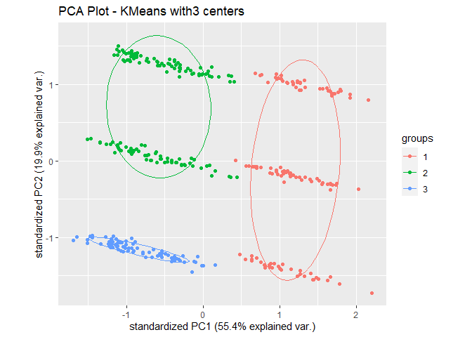
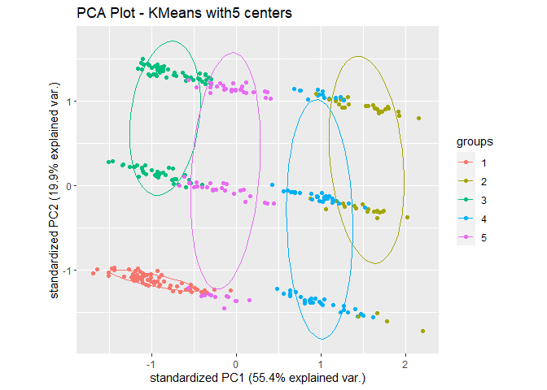
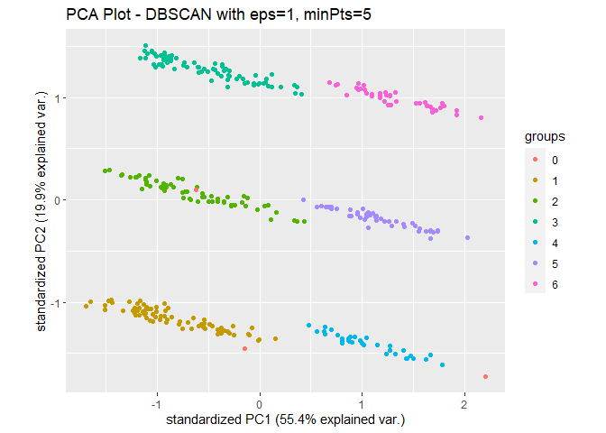
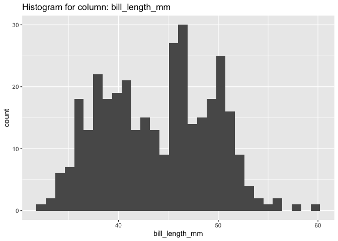
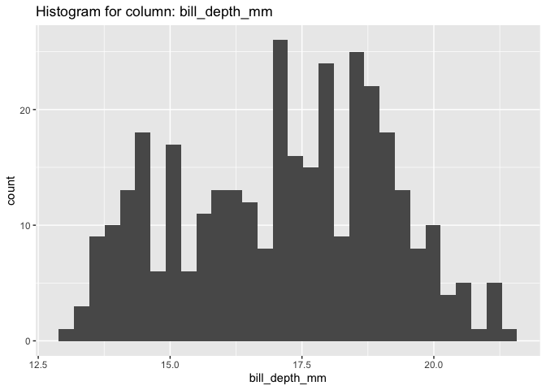
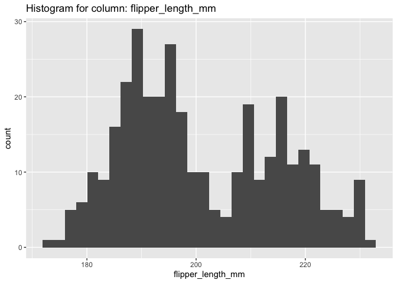

<!-- README.md is generated from README.Rmd. Please edit that file -->

# datascience.eda

<!-- badges: start -->

<!-- badges: end -->

This package includes functions assisting data scientists with various
common tasks during the exploratory data analysis stage of a data
science project. Its functions will help the data scientist to do
preliminary analysis on common column types like numeric columns,
categorical columns and text columns; it will also conduct several
experimental clusterings on the dataset.

Our functions are tailored based on our own experience, there are also
similar packages published, a few good ones worth mentioning:

  - [EDA](https://cran.r-project.org/web/packages/dlookr/vignettes/EDA.html)
  - [SmartEDA](https://cran.r-project.org/web/packages/SmartEDA/vignettes/SmartEDA.html)
  - [DataExplorer](https://github.com/boxuancui/DataExplorer)

## Main functions

  - `explore_numeric_columns`: conducts common exploratory analysis on
    columns with numeric type: it generates a heatmap showing
    correlation coefficients (using `pearson`, `kendall` or `spearman`
    correlation on choice), histograms and SPLOM plots for all numeric
    columns or a list of columns specified by the user. This returns a
    list of plot objects so that the user can save and use them later
    on.

  - `explore_categorical_columns`: performs exploratory analysis on
    categorical features. It returns a list having a tibble with column
    names, corresponding unique categories, counts of null values,
    percentages of null values and most frequent categories along with
    bar plots of user provided categorical columns.

  - `explore_text_columns`: performs exploratory data analysis of text
    features. If text feature columns are not specified, the function
    will try to identify the text features. The function prints the
    summary statistics of character length and word count, and plots a
    histogram of its distributions. It also plots the word cloud of
    words (after removing stopwords) and bi-grams. Bar charts of top 10
    words (after removing stopwords) and top 10 bi-grams will be plotted
    as well. This function returns a list of all the results.

  - `explore_clustering`: fits K-Means and DBSCAN clustering algorithms
    on the dataset and visualizes the clustering using scatterplots on
    PCA transformed data. It returns a dictionary (list) with each key
    being name of the clustering algorithm and the value being a list of
    plots generated by the models.

  - `explore_KMeans_clustering`: fits K-Means clustering algorithms on
    the dataset and visualizes the clustering using scatterplots on PCA
    transformed data. It returns a list of plots.

  - `explore_DBSCAN_clustering`: fits K-DBSCAN clustering algorithms on
    the dataset and visualizes the clustering using scatterplots on PCA
    transformed data. It returns a list of plots.

## Installation

You can install the development version of datascience.eda with:

``` r
# install.packages("devtools")
devtools::install_github("UBC-MDS/datascience.eda.R")
```

## Example

``` r
library(datascience.eda)
library(palmerpenguins)

explore_KMeans_clustering(penguins, centers = seq(3, 5))
#> Warning: did not converge in 10 iterations
#> [[1]]
```



    #> 
    #> [[2]]


    #> 
    #> [[3]]



``` r
explore_DBSCAN_clustering(penguins, eps = c(3, 5), minPts = c(5, 10))
#> [[1]]
```



    #> 
    #> [[2]]



    #> 
    #> [[3]]



    #> 
    #> [[4]]



``` r
explore_numeric_columns(penguins)
#> `stat_bin()` using `bins = 30`. Pick better value with `binwidth`.
#> Warning: Removed 2 rows containing non-finite values (stat_bin).
```


    #> `stat_bin()` using `bins = 30`. Pick better value with `binwidth`.
    #> Warning: Removed 2 rows containing non-finite values (stat_bin).


    #> `stat_bin()` using `bins = 30`. Pick better value with `binwidth`.
    #> Warning: Removed 2 rows containing non-finite values (stat_bin).


    #> `stat_bin()` using `bins = 30`. Pick better value with `binwidth`.
    #> Warning: Removed 2 rows containing non-finite values (stat_bin).


    #> `stat_bin()` using `bins = 30`. Pick better value with `binwidth`.
    #> Registered S3 method overwritten by 'GGally':
    #>   method from   
    #>   +.gg   ggplot2


    #> Warning: Removed 2 rows containing non-finite values (stat_density).
    #> Warning in ggally_statistic(data = data, mapping = mapping, na.rm = na.rm, :
    #> Removed 2 rows containing missing values
    
    #> Warning in ggally_statistic(data = data, mapping = mapping, na.rm = na.rm, :
    #> Removed 2 rows containing missing values
    
    #> Warning in ggally_statistic(data = data, mapping = mapping, na.rm = na.rm, :
    #> Removed 2 rows containing missing values
    
    #> Warning in ggally_statistic(data = data, mapping = mapping, na.rm = na.rm, :
    #> Removed 2 rows containing missing values
    #> Warning: Removed 2 rows containing missing values (geom_point).
    #> Warning: Removed 2 rows containing non-finite values (stat_density).
    #> Warning in ggally_statistic(data = data, mapping = mapping, na.rm = na.rm, :
    #> Removed 2 rows containing missing values
    
    #> Warning in ggally_statistic(data = data, mapping = mapping, na.rm = na.rm, :
    #> Removed 2 rows containing missing values
    
    #> Warning in ggally_statistic(data = data, mapping = mapping, na.rm = na.rm, :
    #> Removed 2 rows containing missing values
    #> Warning: Removed 2 rows containing missing values (geom_point).
    
    #> Warning: Removed 2 rows containing missing values (geom_point).
    #> Warning: Removed 2 rows containing non-finite values (stat_density).
    #> Warning in ggally_statistic(data = data, mapping = mapping, na.rm = na.rm, :
    #> Removed 2 rows containing missing values
    
    #> Warning in ggally_statistic(data = data, mapping = mapping, na.rm = na.rm, :
    #> Removed 2 rows containing missing values
    #> Warning: Removed 2 rows containing missing values (geom_point).
    
    #> Warning: Removed 2 rows containing missing values (geom_point).
    
    #> Warning: Removed 2 rows containing missing values (geom_point).
    #> Warning: Removed 2 rows containing non-finite values (stat_density).
    #> Warning in ggally_statistic(data = data, mapping = mapping, na.rm = na.rm, :
    #> Removed 2 rows containing missing values
    #> Warning: Removed 2 rows containing missing values (geom_point).
    
    #> Warning: Removed 2 rows containing missing values (geom_point).
    
    #> Warning: Removed 2 rows containing missing values (geom_point).
    
    #> Warning: Removed 2 rows containing missing values (geom_point).


    #> $hist
    #> $hist$data
    #> # A tibble: 344 x 5
    #>    bill_length_mm bill_depth_mm flipper_length_mm body_mass_g  year
    #>             <dbl>         <dbl>             <int>       <int> <int>
    #>  1           39.1          18.7               181        3750  2007
    #>  2           39.5          17.4               186        3800  2007
    #>  3           40.3          18                 195        3250  2007
    #>  4           NA            NA                  NA          NA  2007
    #>  5           36.7          19.3               193        3450  2007
    #>  6           39.3          20.6               190        3650  2007
    #>  7           38.9          17.8               181        3625  2007
    #>  8           39.2          19.6               195        4675  2007
    #>  9           34.1          18.1               193        3475  2007
    #> 10           42            20.2               190        4250  2007
    #> # … with 334 more rows
    #> 
    #> $hist$layers
    #> $hist$layers[[1]]
    #> geom_bar: na.rm = FALSE, orientation = NA, flipped_aes = FALSE
    #> stat_bin: binwidth = NULL, bins = NULL, na.rm = FALSE, orientation = NA, pad = FALSE
    #> position_stack 
    #> 
    #> 
    #> $hist$scales
    #> <ggproto object: Class ScalesList, gg>
    #>     add: function
    #>     clone: function
    #>     find: function
    #>     get_scales: function
    #>     has_scale: function
    #>     input: function
    #>     n: function
    #>     non_position_scales: function
    #>     scales: list
    #>     super:  <ggproto object: Class ScalesList, gg>
    #> 
    #> $hist$mapping
    #> Aesthetic mapping: 
    #> * `x` -> `bill_length_mm`
    #> 
    #> $hist$theme
    #> list()
    #> 
    #> $hist$coordinates
    #> <ggproto object: Class CoordCartesian, Coord, gg>
    #>     aspect: function
    #>     backtransform_range: function
    #>     clip: on
    #>     default: TRUE
    #>     distance: function
    #>     expand: TRUE
    #>     is_free: function
    #>     is_linear: function
    #>     labels: function
    #>     limits: list
    #>     modify_scales: function
    #>     range: function
    #>     render_axis_h: function
    #>     render_axis_v: function
    #>     render_bg: function
    #>     render_fg: function
    #>     setup_data: function
    #>     setup_layout: function
    #>     setup_panel_guides: function
    #>     setup_panel_params: function
    #>     setup_params: function
    #>     train_panel_guides: function
    #>     transform: function
    #>     super:  <ggproto object: Class CoordCartesian, Coord, gg>
    #> 
    #> $hist$facet
    #> <ggproto object: Class FacetNull, Facet, gg>
    #>     compute_layout: function
    #>     draw_back: function
    #>     draw_front: function
    #>     draw_labels: function
    #>     draw_panels: function
    #>     finish_data: function
    #>     init_scales: function
    #>     map_data: function
    #>     params: list
    #>     setup_data: function
    #>     setup_params: function
    #>     shrink: TRUE
    #>     train_scales: function
    #>     vars: function
    #>     super:  <ggproto object: Class FacetNull, Facet, gg>
    #> 
    #> $hist$plot_env
    #> <environment: 0x7fcd2e26be30>
    #> 
    #> $hist$labels
    #> $hist$labels$title
    #> [1] "Histogram for column: bill_length_mm"
    #> 
    #> $hist$labels$x
    #> [1] "bill_length_mm"
    #> 
    #> $hist$labels$y
    #> [1] "count"
    #> 
    #> $hist$labels$weight
    #> [1] "weight"
    #> 
    #> 
    #> $hist$data
    #> # A tibble: 344 x 5
    #>    bill_length_mm bill_depth_mm flipper_length_mm body_mass_g  year
    #>             <dbl>         <dbl>             <int>       <int> <int>
    #>  1           39.1          18.7               181        3750  2007
    #>  2           39.5          17.4               186        3800  2007
    #>  3           40.3          18                 195        3250  2007
    #>  4           NA            NA                  NA          NA  2007
    #>  5           36.7          19.3               193        3450  2007
    #>  6           39.3          20.6               190        3650  2007
    #>  7           38.9          17.8               181        3625  2007
    #>  8           39.2          19.6               195        4675  2007
    #>  9           34.1          18.1               193        3475  2007
    #> 10           42            20.2               190        4250  2007
    #> # … with 334 more rows
    #> 
    #> $hist$layers
    #> $hist$layers[[1]]
    #> geom_bar: na.rm = FALSE, orientation = NA, flipped_aes = FALSE
    #> stat_bin: binwidth = NULL, bins = NULL, na.rm = FALSE, orientation = NA, pad = FALSE
    #> position_stack 
    #> 
    #> 
    #> $hist$scales
    #> <ggproto object: Class ScalesList, gg>
    #>     add: function
    #>     clone: function
    #>     find: function
    #>     get_scales: function
    #>     has_scale: function
    #>     input: function
    #>     n: function
    #>     non_position_scales: function
    #>     scales: list
    #>     super:  <ggproto object: Class ScalesList, gg>
    #> 
    #> $hist$mapping
    #> Aesthetic mapping: 
    #> * `x` -> `bill_depth_mm`
    #> 
    #> $hist$theme
    #> list()
    #> 
    #> $hist$coordinates
    #> <ggproto object: Class CoordCartesian, Coord, gg>
    #>     aspect: function
    #>     backtransform_range: function
    #>     clip: on
    #>     default: TRUE
    #>     distance: function
    #>     expand: TRUE
    #>     is_free: function
    #>     is_linear: function
    #>     labels: function
    #>     limits: list
    #>     modify_scales: function
    #>     range: function
    #>     render_axis_h: function
    #>     render_axis_v: function
    #>     render_bg: function
    #>     render_fg: function
    #>     setup_data: function
    #>     setup_layout: function
    #>     setup_panel_guides: function
    #>     setup_panel_params: function
    #>     setup_params: function
    #>     train_panel_guides: function
    #>     transform: function
    #>     super:  <ggproto object: Class CoordCartesian, Coord, gg>
    #> 
    #> $hist$facet
    #> <ggproto object: Class FacetNull, Facet, gg>
    #>     compute_layout: function
    #>     draw_back: function
    #>     draw_front: function
    #>     draw_labels: function
    #>     draw_panels: function
    #>     finish_data: function
    #>     init_scales: function
    #>     map_data: function
    #>     params: list
    #>     setup_data: function
    #>     setup_params: function
    #>     shrink: TRUE
    #>     train_scales: function
    #>     vars: function
    #>     super:  <ggproto object: Class FacetNull, Facet, gg>
    #> 
    #> $hist$plot_env
    #> <environment: 0x7fcd2e26be30>
    #> 
    #> $hist$labels
    #> $hist$labels$title
    #> [1] "Histogram for column: bill_depth_mm"
    #> 
    #> $hist$labels$x
    #> [1] "bill_depth_mm"
    #> 
    #> $hist$labels$y
    #> [1] "count"
    #> 
    #> $hist$labels$weight
    #> [1] "weight"
    #> 
    #> 
    #> $hist$data
    #> # A tibble: 344 x 5
    #>    bill_length_mm bill_depth_mm flipper_length_mm body_mass_g  year
    #>             <dbl>         <dbl>             <int>       <int> <int>
    #>  1           39.1          18.7               181        3750  2007
    #>  2           39.5          17.4               186        3800  2007
    #>  3           40.3          18                 195        3250  2007
    #>  4           NA            NA                  NA          NA  2007
    #>  5           36.7          19.3               193        3450  2007
    #>  6           39.3          20.6               190        3650  2007
    #>  7           38.9          17.8               181        3625  2007
    #>  8           39.2          19.6               195        4675  2007
    #>  9           34.1          18.1               193        3475  2007
    #> 10           42            20.2               190        4250  2007
    #> # … with 334 more rows
    #> 
    #> $hist$layers
    #> $hist$layers[[1]]
    #> geom_bar: na.rm = FALSE, orientation = NA, flipped_aes = FALSE
    #> stat_bin: binwidth = NULL, bins = NULL, na.rm = FALSE, orientation = NA, pad = FALSE
    #> position_stack 
    #> 
    #> 
    #> $hist$scales
    #> <ggproto object: Class ScalesList, gg>
    #>     add: function
    #>     clone: function
    #>     find: function
    #>     get_scales: function
    #>     has_scale: function
    #>     input: function
    #>     n: function
    #>     non_position_scales: function
    #>     scales: list
    #>     super:  <ggproto object: Class ScalesList, gg>
    #> 
    #> $hist$mapping
    #> Aesthetic mapping: 
    #> * `x` -> `flipper_length_mm`
    #> 
    #> $hist$theme
    #> list()
    #> 
    #> $hist$coordinates
    #> <ggproto object: Class CoordCartesian, Coord, gg>
    #>     aspect: function
    #>     backtransform_range: function
    #>     clip: on
    #>     default: TRUE
    #>     distance: function
    #>     expand: TRUE
    #>     is_free: function
    #>     is_linear: function
    #>     labels: function
    #>     limits: list
    #>     modify_scales: function
    #>     range: function
    #>     render_axis_h: function
    #>     render_axis_v: function
    #>     render_bg: function
    #>     render_fg: function
    #>     setup_data: function
    #>     setup_layout: function
    #>     setup_panel_guides: function
    #>     setup_panel_params: function
    #>     setup_params: function
    #>     train_panel_guides: function
    #>     transform: function
    #>     super:  <ggproto object: Class CoordCartesian, Coord, gg>
    #> 
    #> $hist$facet
    #> <ggproto object: Class FacetNull, Facet, gg>
    #>     compute_layout: function
    #>     draw_back: function
    #>     draw_front: function
    #>     draw_labels: function
    #>     draw_panels: function
    #>     finish_data: function
    #>     init_scales: function
    #>     map_data: function
    #>     params: list
    #>     setup_data: function
    #>     setup_params: function
    #>     shrink: TRUE
    #>     train_scales: function
    #>     vars: function
    #>     super:  <ggproto object: Class FacetNull, Facet, gg>
    #> 
    #> $hist$plot_env
    #> <environment: 0x7fcd2e26be30>
    #> 
    #> $hist$labels
    #> $hist$labels$title
    #> [1] "Histogram for column: flipper_length_mm"
    #> 
    #> $hist$labels$x
    #> [1] "flipper_length_mm"
    #> 
    #> $hist$labels$y
    #> [1] "count"
    #> 
    #> $hist$labels$weight
    #> [1] "weight"
    #> 
    #> 
    #> $hist$data
    #> # A tibble: 344 x 5
    #>    bill_length_mm bill_depth_mm flipper_length_mm body_mass_g  year
    #>             <dbl>         <dbl>             <int>       <int> <int>
    #>  1           39.1          18.7               181        3750  2007
    #>  2           39.5          17.4               186        3800  2007
    #>  3           40.3          18                 195        3250  2007
    #>  4           NA            NA                  NA          NA  2007
    #>  5           36.7          19.3               193        3450  2007
    #>  6           39.3          20.6               190        3650  2007
    #>  7           38.9          17.8               181        3625  2007
    #>  8           39.2          19.6               195        4675  2007
    #>  9           34.1          18.1               193        3475  2007
    #> 10           42            20.2               190        4250  2007
    #> # … with 334 more rows
    #> 
    #> $hist$layers
    #> $hist$layers[[1]]
    #> geom_bar: na.rm = FALSE, orientation = NA, flipped_aes = FALSE
    #> stat_bin: binwidth = NULL, bins = NULL, na.rm = FALSE, orientation = NA, pad = FALSE
    #> position_stack 
    #> 
    #> 
    #> $hist$scales
    #> <ggproto object: Class ScalesList, gg>
    #>     add: function
    #>     clone: function
    #>     find: function
    #>     get_scales: function
    #>     has_scale: function
    #>     input: function
    #>     n: function
    #>     non_position_scales: function
    #>     scales: list
    #>     super:  <ggproto object: Class ScalesList, gg>
    #> 
    #> $hist$mapping
    #> Aesthetic mapping: 
    #> * `x` -> `body_mass_g`
    #> 
    #> $hist$theme
    #> list()
    #> 
    #> $hist$coordinates
    #> <ggproto object: Class CoordCartesian, Coord, gg>
    #>     aspect: function
    #>     backtransform_range: function
    #>     clip: on
    #>     default: TRUE
    #>     distance: function
    #>     expand: TRUE
    #>     is_free: function
    #>     is_linear: function
    #>     labels: function
    #>     limits: list
    #>     modify_scales: function
    #>     range: function
    #>     render_axis_h: function
    #>     render_axis_v: function
    #>     render_bg: function
    #>     render_fg: function
    #>     setup_data: function
    #>     setup_layout: function
    #>     setup_panel_guides: function
    #>     setup_panel_params: function
    #>     setup_params: function
    #>     train_panel_guides: function
    #>     transform: function
    #>     super:  <ggproto object: Class CoordCartesian, Coord, gg>
    #> 
    #> $hist$facet
    #> <ggproto object: Class FacetNull, Facet, gg>
    #>     compute_layout: function
    #>     draw_back: function
    #>     draw_front: function
    #>     draw_labels: function
    #>     draw_panels: function
    #>     finish_data: function
    #>     init_scales: function
    #>     map_data: function
    #>     params: list
    #>     setup_data: function
    #>     setup_params: function
    #>     shrink: TRUE
    #>     train_scales: function
    #>     vars: function
    #>     super:  <ggproto object: Class FacetNull, Facet, gg>
    #> 
    #> $hist$plot_env
    #> <environment: 0x7fcd2e26be30>
    #> 
    #> $hist$labels
    #> $hist$labels$title
    #> [1] "Histogram for column: body_mass_g"
    #> 
    #> $hist$labels$x
    #> [1] "body_mass_g"
    #> 
    #> $hist$labels$y
    #> [1] "count"
    #> 
    #> $hist$labels$weight
    #> [1] "weight"
    #> 
    #> 
    #> $hist$data
    #> # A tibble: 344 x 5
    #>    bill_length_mm bill_depth_mm flipper_length_mm body_mass_g  year
    #>             <dbl>         <dbl>             <int>       <int> <int>
    #>  1           39.1          18.7               181        3750  2007
    #>  2           39.5          17.4               186        3800  2007
    #>  3           40.3          18                 195        3250  2007
    #>  4           NA            NA                  NA          NA  2007
    #>  5           36.7          19.3               193        3450  2007
    #>  6           39.3          20.6               190        3650  2007
    #>  7           38.9          17.8               181        3625  2007
    #>  8           39.2          19.6               195        4675  2007
    #>  9           34.1          18.1               193        3475  2007
    #> 10           42            20.2               190        4250  2007
    #> # … with 334 more rows
    #> 
    #> $hist$layers
    #> $hist$layers[[1]]
    #> geom_bar: na.rm = FALSE, orientation = NA, flipped_aes = FALSE
    #> stat_bin: binwidth = NULL, bins = NULL, na.rm = FALSE, orientation = NA, pad = FALSE
    #> position_stack 
    #> 
    #> 
    #> $hist$scales
    #> <ggproto object: Class ScalesList, gg>
    #>     add: function
    #>     clone: function
    #>     find: function
    #>     get_scales: function
    #>     has_scale: function
    #>     input: function
    #>     n: function
    #>     non_position_scales: function
    #>     scales: list
    #>     super:  <ggproto object: Class ScalesList, gg>
    #> 
    #> $hist$mapping
    #> Aesthetic mapping: 
    #> * `x` -> `year`
    #> 
    #> $hist$theme
    #> list()
    #> 
    #> $hist$coordinates
    #> <ggproto object: Class CoordCartesian, Coord, gg>
    #>     aspect: function
    #>     backtransform_range: function
    #>     clip: on
    #>     default: TRUE
    #>     distance: function
    #>     expand: TRUE
    #>     is_free: function
    #>     is_linear: function
    #>     labels: function
    #>     limits: list
    #>     modify_scales: function
    #>     range: function
    #>     render_axis_h: function
    #>     render_axis_v: function
    #>     render_bg: function
    #>     render_fg: function
    #>     setup_data: function
    #>     setup_layout: function
    #>     setup_panel_guides: function
    #>     setup_panel_params: function
    #>     setup_params: function
    #>     train_panel_guides: function
    #>     transform: function
    #>     super:  <ggproto object: Class CoordCartesian, Coord, gg>
    #> 
    #> $hist$facet
    #> <ggproto object: Class FacetNull, Facet, gg>
    #>     compute_layout: function
    #>     draw_back: function
    #>     draw_front: function
    #>     draw_labels: function
    #>     draw_panels: function
    #>     finish_data: function
    #>     init_scales: function
    #>     map_data: function
    #>     params: list
    #>     setup_data: function
    #>     setup_params: function
    #>     shrink: TRUE
    #>     train_scales: function
    #>     vars: function
    #>     super:  <ggproto object: Class FacetNull, Facet, gg>
    #> 
    #> $hist$plot_env
    #> <environment: 0x7fcd2e26be30>
    #> 
    #> $hist$labels
    #> $hist$labels$title
    #> [1] "Histogram for column: year"
    #> 
    #> $hist$labels$x
    #> [1] "year"
    #> 
    #> $hist$labels$y
    #> [1] "count"
    #> 
    #> $hist$labels$weight
    #> [1] "weight"
    #> 
    #> 
    #> 
    #> $pair
    #> $pair$data
    #>     bill_length_mm bill_depth_mm flipper_length_mm body_mass_g year
    #> 1             39.1          18.7               181        3750 2007
    #> 2             39.5          17.4               186        3800 2007
    #> 3             40.3          18.0               195        3250 2007
    #> 4               NA            NA                NA          NA 2007
    #> 5             36.7          19.3               193        3450 2007
    #> 6             39.3          20.6               190        3650 2007
    #> 7             38.9          17.8               181        3625 2007
    #> 8             39.2          19.6               195        4675 2007
    #> 9             34.1          18.1               193        3475 2007
    #> 10            42.0          20.2               190        4250 2007
    #> 11            37.8          17.1               186        3300 2007
    #> 12            37.8          17.3               180        3700 2007
    #> 13            41.1          17.6               182        3200 2007
    #> 14            38.6          21.2               191        3800 2007
    #> 15            34.6          21.1               198        4400 2007
    #> 16            36.6          17.8               185        3700 2007
    #> 17            38.7          19.0               195        3450 2007
    #> 18            42.5          20.7               197        4500 2007
    #> 19            34.4          18.4               184        3325 2007
    #> 20            46.0          21.5               194        4200 2007
    #> 21            37.8          18.3               174        3400 2007
    #> 22            37.7          18.7               180        3600 2007
    #> 23            35.9          19.2               189        3800 2007
    #> 24            38.2          18.1               185        3950 2007
    #> 25            38.8          17.2               180        3800 2007
    #> 26            35.3          18.9               187        3800 2007
    #> 27            40.6          18.6               183        3550 2007
    #> 28            40.5          17.9               187        3200 2007
    #> 29            37.9          18.6               172        3150 2007
    #> 30            40.5          18.9               180        3950 2007
    #> 31            39.5          16.7               178        3250 2007
    #> 32            37.2          18.1               178        3900 2007
    #> 33            39.5          17.8               188        3300 2007
    #> 34            40.9          18.9               184        3900 2007
    #> 35            36.4          17.0               195        3325 2007
    #> 36            39.2          21.1               196        4150 2007
    #> 37            38.8          20.0               190        3950 2007
    #> 38            42.2          18.5               180        3550 2007
    #> 39            37.6          19.3               181        3300 2007
    #> 40            39.8          19.1               184        4650 2007
    #> 41            36.5          18.0               182        3150 2007
    #> 42            40.8          18.4               195        3900 2007
    #> 43            36.0          18.5               186        3100 2007
    #> 44            44.1          19.7               196        4400 2007
    #> 45            37.0          16.9               185        3000 2007
    #> 46            39.6          18.8               190        4600 2007
    #> 47            41.1          19.0               182        3425 2007
    #> 48            37.5          18.9               179        2975 2007
    #> 49            36.0          17.9               190        3450 2007
    #> 50            42.3          21.2               191        4150 2007
    #> 51            39.6          17.7               186        3500 2008
    #> 52            40.1          18.9               188        4300 2008
    #> 53            35.0          17.9               190        3450 2008
    #> 54            42.0          19.5               200        4050 2008
    #> 55            34.5          18.1               187        2900 2008
    #> 56            41.4          18.6               191        3700 2008
    #> 57            39.0          17.5               186        3550 2008
    #> 58            40.6          18.8               193        3800 2008
    #> 59            36.5          16.6               181        2850 2008
    #> 60            37.6          19.1               194        3750 2008
    #> 61            35.7          16.9               185        3150 2008
    #> 62            41.3          21.1               195        4400 2008
    #> 63            37.6          17.0               185        3600 2008
    #> 64            41.1          18.2               192        4050 2008
    #> 65            36.4          17.1               184        2850 2008
    #> 66            41.6          18.0               192        3950 2008
    #> 67            35.5          16.2               195        3350 2008
    #> 68            41.1          19.1               188        4100 2008
    #> 69            35.9          16.6               190        3050 2008
    #> 70            41.8          19.4               198        4450 2008
    #> 71            33.5          19.0               190        3600 2008
    #> 72            39.7          18.4               190        3900 2008
    #> 73            39.6          17.2               196        3550 2008
    #> 74            45.8          18.9               197        4150 2008
    #> 75            35.5          17.5               190        3700 2008
    #> 76            42.8          18.5               195        4250 2008
    #> 77            40.9          16.8               191        3700 2008
    #> 78            37.2          19.4               184        3900 2008
    #> 79            36.2          16.1               187        3550 2008
    #> 80            42.1          19.1               195        4000 2008
    #> 81            34.6          17.2               189        3200 2008
    #> 82            42.9          17.6               196        4700 2008
    #> 83            36.7          18.8               187        3800 2008
    #> 84            35.1          19.4               193        4200 2008
    #> 85            37.3          17.8               191        3350 2008
    #> 86            41.3          20.3               194        3550 2008
    #> 87            36.3          19.5               190        3800 2008
    #> 88            36.9          18.6               189        3500 2008
    #> 89            38.3          19.2               189        3950 2008
    #> 90            38.9          18.8               190        3600 2008
    #> 91            35.7          18.0               202        3550 2008
    #> 92            41.1          18.1               205        4300 2008
    #> 93            34.0          17.1               185        3400 2008
    #> 94            39.6          18.1               186        4450 2008
    #> 95            36.2          17.3               187        3300 2008
    #> 96            40.8          18.9               208        4300 2008
    #> 97            38.1          18.6               190        3700 2008
    #> 98            40.3          18.5               196        4350 2008
    #> 99            33.1          16.1               178        2900 2008
    #> 100           43.2          18.5               192        4100 2008
    #> 101           35.0          17.9               192        3725 2009
    #> 102           41.0          20.0               203        4725 2009
    #> 103           37.7          16.0               183        3075 2009
    #> 104           37.8          20.0               190        4250 2009
    #> 105           37.9          18.6               193        2925 2009
    #> 106           39.7          18.9               184        3550 2009
    #> 107           38.6          17.2               199        3750 2009
    #> 108           38.2          20.0               190        3900 2009
    #> 109           38.1          17.0               181        3175 2009
    #> 110           43.2          19.0               197        4775 2009
    #> 111           38.1          16.5               198        3825 2009
    #> 112           45.6          20.3               191        4600 2009
    #> 113           39.7          17.7               193        3200 2009
    #> 114           42.2          19.5               197        4275 2009
    #> 115           39.6          20.7               191        3900 2009
    #> 116           42.7          18.3               196        4075 2009
    #> 117           38.6          17.0               188        2900 2009
    #> 118           37.3          20.5               199        3775 2009
    #> 119           35.7          17.0               189        3350 2009
    #> 120           41.1          18.6               189        3325 2009
    #> 121           36.2          17.2               187        3150 2009
    #> 122           37.7          19.8               198        3500 2009
    #> 123           40.2          17.0               176        3450 2009
    #> 124           41.4          18.5               202        3875 2009
    #> 125           35.2          15.9               186        3050 2009
    #> 126           40.6          19.0               199        4000 2009
    #> 127           38.8          17.6               191        3275 2009
    #> 128           41.5          18.3               195        4300 2009
    #> 129           39.0          17.1               191        3050 2009
    #> 130           44.1          18.0               210        4000 2009
    #> 131           38.5          17.9               190        3325 2009
    #> 132           43.1          19.2               197        3500 2009
    #> 133           36.8          18.5               193        3500 2009
    #> 134           37.5          18.5               199        4475 2009
    #> 135           38.1          17.6               187        3425 2009
    #> 136           41.1          17.5               190        3900 2009
    #> 137           35.6          17.5               191        3175 2009
    #> 138           40.2          20.1               200        3975 2009
    #> 139           37.0          16.5               185        3400 2009
    #> 140           39.7          17.9               193        4250 2009
    #> 141           40.2          17.1               193        3400 2009
    #> 142           40.6          17.2               187        3475 2009
    #> 143           32.1          15.5               188        3050 2009
    #> 144           40.7          17.0               190        3725 2009
    #> 145           37.3          16.8               192        3000 2009
    #> 146           39.0          18.7               185        3650 2009
    #> 147           39.2          18.6               190        4250 2009
    #> 148           36.6          18.4               184        3475 2009
    #> 149           36.0          17.8               195        3450 2009
    #> 150           37.8          18.1               193        3750 2009
    #> 151           36.0          17.1               187        3700 2009
    #> 152           41.5          18.5               201        4000 2009
    #> 153           46.1          13.2               211        4500 2007
    #> 154           50.0          16.3               230        5700 2007
    #> 155           48.7          14.1               210        4450 2007
    #> 156           50.0          15.2               218        5700 2007
    #> 157           47.6          14.5               215        5400 2007
    #> 158           46.5          13.5               210        4550 2007
    #> 159           45.4          14.6               211        4800 2007
    #> 160           46.7          15.3               219        5200 2007
    #> 161           43.3          13.4               209        4400 2007
    #> 162           46.8          15.4               215        5150 2007
    #> 163           40.9          13.7               214        4650 2007
    #> 164           49.0          16.1               216        5550 2007
    #> 165           45.5          13.7               214        4650 2007
    #> 166           48.4          14.6               213        5850 2007
    #> 167           45.8          14.6               210        4200 2007
    #> 168           49.3          15.7               217        5850 2007
    #> 169           42.0          13.5               210        4150 2007
    #> 170           49.2          15.2               221        6300 2007
    #> 171           46.2          14.5               209        4800 2007
    #> 172           48.7          15.1               222        5350 2007
    #> 173           50.2          14.3               218        5700 2007
    #> 174           45.1          14.5               215        5000 2007
    #> 175           46.5          14.5               213        4400 2007
    #> 176           46.3          15.8               215        5050 2007
    #> 177           42.9          13.1               215        5000 2007
    #> 178           46.1          15.1               215        5100 2007
    #> 179           44.5          14.3               216        4100 2007
    #> 180           47.8          15.0               215        5650 2007
    #> 181           48.2          14.3               210        4600 2007
    #> 182           50.0          15.3               220        5550 2007
    #> 183           47.3          15.3               222        5250 2007
    #> 184           42.8          14.2               209        4700 2007
    #> 185           45.1          14.5               207        5050 2007
    #> 186           59.6          17.0               230        6050 2007
    #> 187           49.1          14.8               220        5150 2008
    #> 188           48.4          16.3               220        5400 2008
    #> 189           42.6          13.7               213        4950 2008
    #> 190           44.4          17.3               219        5250 2008
    #> 191           44.0          13.6               208        4350 2008
    #> 192           48.7          15.7               208        5350 2008
    #> 193           42.7          13.7               208        3950 2008
    #> 194           49.6          16.0               225        5700 2008
    #> 195           45.3          13.7               210        4300 2008
    #> 196           49.6          15.0               216        4750 2008
    #> 197           50.5          15.9               222        5550 2008
    #> 198           43.6          13.9               217        4900 2008
    #> 199           45.5          13.9               210        4200 2008
    #> 200           50.5          15.9               225        5400 2008
    #> 201           44.9          13.3               213        5100 2008
    #> 202           45.2          15.8               215        5300 2008
    #> 203           46.6          14.2               210        4850 2008
    #> 204           48.5          14.1               220        5300 2008
    #> 205           45.1          14.4               210        4400 2008
    #> 206           50.1          15.0               225        5000 2008
    #> 207           46.5          14.4               217        4900 2008
    #> 208           45.0          15.4               220        5050 2008
    #> 209           43.8          13.9               208        4300 2008
    #> 210           45.5          15.0               220        5000 2008
    #> 211           43.2          14.5               208        4450 2008
    #> 212           50.4          15.3               224        5550 2008
    #> 213           45.3          13.8               208        4200 2008
    #> 214           46.2          14.9               221        5300 2008
    #> 215           45.7          13.9               214        4400 2008
    #> 216           54.3          15.7               231        5650 2008
    #> 217           45.8          14.2               219        4700 2008
    #> 218           49.8          16.8               230        5700 2008
    #> 219           46.2          14.4               214        4650 2008
    #> 220           49.5          16.2               229        5800 2008
    #> 221           43.5          14.2               220        4700 2008
    #> 222           50.7          15.0               223        5550 2008
    #> 223           47.7          15.0               216        4750 2008
    #> 224           46.4          15.6               221        5000 2008
    #> 225           48.2          15.6               221        5100 2008
    #> 226           46.5          14.8               217        5200 2008
    #> 227           46.4          15.0               216        4700 2008
    #> 228           48.6          16.0               230        5800 2008
    #> 229           47.5          14.2               209        4600 2008
    #> 230           51.1          16.3               220        6000 2008
    #> 231           45.2          13.8               215        4750 2008
    #> 232           45.2          16.4               223        5950 2008
    #> 233           49.1          14.5               212        4625 2009
    #> 234           52.5          15.6               221        5450 2009
    #> 235           47.4          14.6               212        4725 2009
    #> 236           50.0          15.9               224        5350 2009
    #> 237           44.9          13.8               212        4750 2009
    #> 238           50.8          17.3               228        5600 2009
    #> 239           43.4          14.4               218        4600 2009
    #> 240           51.3          14.2               218        5300 2009
    #> 241           47.5          14.0               212        4875 2009
    #> 242           52.1          17.0               230        5550 2009
    #> 243           47.5          15.0               218        4950 2009
    #> 244           52.2          17.1               228        5400 2009
    #> 245           45.5          14.5               212        4750 2009
    #> 246           49.5          16.1               224        5650 2009
    #> 247           44.5          14.7               214        4850 2009
    #> 248           50.8          15.7               226        5200 2009
    #> 249           49.4          15.8               216        4925 2009
    #> 250           46.9          14.6               222        4875 2009
    #> 251           48.4          14.4               203        4625 2009
    #> 252           51.1          16.5               225        5250 2009
    #> 253           48.5          15.0               219        4850 2009
    #> 254           55.9          17.0               228        5600 2009
    #> 255           47.2          15.5               215        4975 2009
    #> 256           49.1          15.0               228        5500 2009
    #> 257           47.3          13.8               216        4725 2009
    #> 258           46.8          16.1               215        5500 2009
    #> 259           41.7          14.7               210        4700 2009
    #> 260           53.4          15.8               219        5500 2009
    #> 261           43.3          14.0               208        4575 2009
    #> 262           48.1          15.1               209        5500 2009
    #> 263           50.5          15.2               216        5000 2009
    #> 264           49.8          15.9               229        5950 2009
    #> 265           43.5          15.2               213        4650 2009
    #> 266           51.5          16.3               230        5500 2009
    #> 267           46.2          14.1               217        4375 2009
    #> 268           55.1          16.0               230        5850 2009
    #> 269           44.5          15.7               217        4875 2009
    #> 270           48.8          16.2               222        6000 2009
    #> 271           47.2          13.7               214        4925 2009
    #> 272             NA            NA                NA          NA 2009
    #> 273           46.8          14.3               215        4850 2009
    #> 274           50.4          15.7               222        5750 2009
    #> 275           45.2          14.8               212        5200 2009
    #> 276           49.9          16.1               213        5400 2009
    #> 277           46.5          17.9               192        3500 2007
    #> 278           50.0          19.5               196        3900 2007
    #> 279           51.3          19.2               193        3650 2007
    #> 280           45.4          18.7               188        3525 2007
    #> 281           52.7          19.8               197        3725 2007
    #> 282           45.2          17.8               198        3950 2007
    #> 283           46.1          18.2               178        3250 2007
    #> 284           51.3          18.2               197        3750 2007
    #> 285           46.0          18.9               195        4150 2007
    #> 286           51.3          19.9               198        3700 2007
    #> 287           46.6          17.8               193        3800 2007
    #> 288           51.7          20.3               194        3775 2007
    #> 289           47.0          17.3               185        3700 2007
    #> 290           52.0          18.1               201        4050 2007
    #> 291           45.9          17.1               190        3575 2007
    #> 292           50.5          19.6               201        4050 2007
    #> 293           50.3          20.0               197        3300 2007
    #> 294           58.0          17.8               181        3700 2007
    #> 295           46.4          18.6               190        3450 2007
    #> 296           49.2          18.2               195        4400 2007
    #> 297           42.4          17.3               181        3600 2007
    #> 298           48.5          17.5               191        3400 2007
    #> 299           43.2          16.6               187        2900 2007
    #> 300           50.6          19.4               193        3800 2007
    #> 301           46.7          17.9               195        3300 2007
    #> 302           52.0          19.0               197        4150 2007
    #> 303           50.5          18.4               200        3400 2008
    #> 304           49.5          19.0               200        3800 2008
    #> 305           46.4          17.8               191        3700 2008
    #> 306           52.8          20.0               205        4550 2008
    #> 307           40.9          16.6               187        3200 2008
    #> 308           54.2          20.8               201        4300 2008
    #> 309           42.5          16.7               187        3350 2008
    #> 310           51.0          18.8               203        4100 2008
    #> 311           49.7          18.6               195        3600 2008
    #> 312           47.5          16.8               199        3900 2008
    #> 313           47.6          18.3               195        3850 2008
    #> 314           52.0          20.7               210        4800 2008
    #> 315           46.9          16.6               192        2700 2008
    #> 316           53.5          19.9               205        4500 2008
    #> 317           49.0          19.5               210        3950 2008
    #> 318           46.2          17.5               187        3650 2008
    #> 319           50.9          19.1               196        3550 2008
    #> 320           45.5          17.0               196        3500 2008
    #> 321           50.9          17.9               196        3675 2009
    #> 322           50.8          18.5               201        4450 2009
    #> 323           50.1          17.9               190        3400 2009
    #> 324           49.0          19.6               212        4300 2009
    #> 325           51.5          18.7               187        3250 2009
    #> 326           49.8          17.3               198        3675 2009
    #> 327           48.1          16.4               199        3325 2009
    #> 328           51.4          19.0               201        3950 2009
    #> 329           45.7          17.3               193        3600 2009
    #> 330           50.7          19.7               203        4050 2009
    #> 331           42.5          17.3               187        3350 2009
    #> 332           52.2          18.8               197        3450 2009
    #> 333           45.2          16.6               191        3250 2009
    #> 334           49.3          19.9               203        4050 2009
    #> 335           50.2          18.8               202        3800 2009
    #> 336           45.6          19.4               194        3525 2009
    #> 337           51.9          19.5               206        3950 2009
    #> 338           46.8          16.5               189        3650 2009
    #> 339           45.7          17.0               195        3650 2009
    #> 340           55.8          19.8               207        4000 2009
    #> 341           43.5          18.1               202        3400 2009
    #> 342           49.6          18.2               193        3775 2009
    #> 343           50.8          19.0               210        4100 2009
    #> 344           50.2          18.7               198        3775 2009
    #> 
    #> $pair$plots
    #> $pair$plots[[1]]
    #> $fn
    #> function (data, mapping, ...) 
    #> {
    #>     allParams$data <- data
    #>     allParams$mapping <- mapping
    #>     argsList <- list(...)
    #>     allParams[names(argsList)] <- argsList
    #>     do.call(original_fn, allParams)
    #> }
    #> <bytecode: 0x7fcd2bd69530>
    #> <environment: 0x7fcd2bd75bf8>
    #> attr(,"class")
    #> [1] "ggmatrix_fn_with_params"
    #> attr(,"name")
    #> [1] "ggally_densityDiag"
    #> attr(,"params")
    #> list()
    #> attr(,"fn")
    #> function (data, mapping, ..., rescale = FALSE) 
    #> {
    #>     mapping <- mapping_color_to_fill(mapping)
    #>     p <- ggplot(data, mapping) + scale_y_continuous()
    #>     if (identical(rescale, TRUE)) {
    #>         p <- p + stat_density(aes(y = ..scaled.. * diff(range(x, 
    #>             na.rm = TRUE)) + min(x, na.rm = TRUE)), position = "identity", 
    #>             geom = "line", ...)
    #>     }
    #>     else {
    #>         p <- p + geom_density(...)
    #>     }
    #>     p
    #> }
    #> <bytecode: 0x7fcd2bd6ea40>
    #> <environment: namespace:GGally>
    #> 
    #> $mapping
    #> Aesthetic mapping: 
    #> * `x` -> `bill_length_mm`
    #> 
    #> $dataPos
    #> [1] 1
    #> 
    #> $gg
    #> NULL
    #> 
    #> attr(,"class")
    #> [1] "ggmatrix_plot_obj"
    #> 
    #> $pair$plots[[2]]
    #> $fn
    #> function (data, mapping, ...) 
    #> {
    #>     allParams$data <- data
    #>     allParams$mapping <- mapping
    #>     argsList <- list(...)
    #>     allParams[names(argsList)] <- argsList
    #>     do.call(original_fn, allParams)
    #> }
    #> <bytecode: 0x7fcd2bd69530>
    #> <environment: 0x7fcd2bdbf458>
    #> attr(,"class")
    #> [1] "ggmatrix_fn_with_params"
    #> attr(,"name")
    #> [1] "ggally_cor"
    #> attr(,"params")
    #> list()
    #> attr(,"fn")
    #> function (data, mapping, ..., stars = TRUE, method = "pearson", 
    #>     use = "complete.obs", display_grid = FALSE, digits = 3, title_args = list(...), 
    #>     group_args = list(...), justify_labels = "right", align_percent = 0.5, 
    #>     title = "Corr", alignPercent = warning("deprecated. Use `align_percent`"), 
    #>     displayGrid = warning("deprecated. Use `display_grid`")) 
    #> {
    #>     if (!missing(alignPercent)) {
    #>         warning("`alignPercent` is deprecated. Please use `align_percent` if alignment still needs to be adjusted")
    #>         align_percent <- alignPercent
    #>     }
    #>     if (!missing(displayGrid)) {
    #>         warning("`displayGrid` is deprecated. Please use `display_grid`")
    #>         display_grid <- displayGrid
    #>     }
    #>     na.rm <- if (missing(use)) {
    #>         NA
    #>     }
    #>     else {
    #>         (use %in% c("complete.obs", "pairwise.complete.obs", 
    #>             "na.or.complete"))
    #>     }
    #>     ggally_statistic(data = data, mapping = mapping, na.rm = na.rm, 
    #>         align_percent = align_percent, display_grid = display_grid, 
    #>         title_args = title_args, group_args = group_args, justify_labels = justify_labels, 
    #>         justify_text = "left", sep = if ("colour" %in% names(mapping)) 
    #>             ": "
    #>         else ":\n", title = title, text_fn = function(x, y) {
    #>             if (is_date(x)) {
    #>                 x <- as.numeric(x)
    #>             }
    #>             if (is_date(y)) {
    #>                 y <- as.numeric(y)
    #>             }
    #>             corObj <- stats::cor.test(x, y, method = method, 
    #>                 use = use)
    #>             cor_est <- as.numeric(corObj$estimate)
    #>             cor_txt <- formatC(cor_est, digits = digits, format = "f")
    #>             if (isTRUE(stars)) {
    #>                 cor_txt <- str_c(cor_txt, signif_stars(corObj$p.value))
    #>             }
    #>             cor_txt
    #>         })
    #> }
    #> <bytecode: 0x7fcd2bd4f4f0>
    #> <environment: namespace:GGally>
    #> 
    #> $mapping
    #> Aesthetic mapping: 
    #> * `x` -> `bill_depth_mm`
    #> * `y` -> `bill_length_mm`
    #> 
    #> $dataPos
    #> [1] 1
    #> 
    #> $gg
    #> NULL
    #> 
    #> attr(,"class")
    #> [1] "ggmatrix_plot_obj"
    #> 
    #> $pair$plots[[3]]
    #> $fn
    #> function (data, mapping, ...) 
    #> {
    #>     allParams$data <- data
    #>     allParams$mapping <- mapping
    #>     argsList <- list(...)
    #>     allParams[names(argsList)] <- argsList
    #>     do.call(original_fn, allParams)
    #> }
    #> <bytecode: 0x7fcd2bd69530>
    #> <environment: 0x7fcd2bddfbc8>
    #> attr(,"class")
    #> [1] "ggmatrix_fn_with_params"
    #> attr(,"name")
    #> [1] "ggally_cor"
    #> attr(,"params")
    #> list()
    #> attr(,"fn")
    #> function (data, mapping, ..., stars = TRUE, method = "pearson", 
    #>     use = "complete.obs", display_grid = FALSE, digits = 3, title_args = list(...), 
    #>     group_args = list(...), justify_labels = "right", align_percent = 0.5, 
    #>     title = "Corr", alignPercent = warning("deprecated. Use `align_percent`"), 
    #>     displayGrid = warning("deprecated. Use `display_grid`")) 
    #> {
    #>     if (!missing(alignPercent)) {
    #>         warning("`alignPercent` is deprecated. Please use `align_percent` if alignment still needs to be adjusted")
    #>         align_percent <- alignPercent
    #>     }
    #>     if (!missing(displayGrid)) {
    #>         warning("`displayGrid` is deprecated. Please use `display_grid`")
    #>         display_grid <- displayGrid
    #>     }
    #>     na.rm <- if (missing(use)) {
    #>         NA
    #>     }
    #>     else {
    #>         (use %in% c("complete.obs", "pairwise.complete.obs", 
    #>             "na.or.complete"))
    #>     }
    #>     ggally_statistic(data = data, mapping = mapping, na.rm = na.rm, 
    #>         align_percent = align_percent, display_grid = display_grid, 
    #>         title_args = title_args, group_args = group_args, justify_labels = justify_labels, 
    #>         justify_text = "left", sep = if ("colour" %in% names(mapping)) 
    #>             ": "
    #>         else ":\n", title = title, text_fn = function(x, y) {
    #>             if (is_date(x)) {
    #>                 x <- as.numeric(x)
    #>             }
    #>             if (is_date(y)) {
    #>                 y <- as.numeric(y)
    #>             }
    #>             corObj <- stats::cor.test(x, y, method = method, 
    #>                 use = use)
    #>             cor_est <- as.numeric(corObj$estimate)
    #>             cor_txt <- formatC(cor_est, digits = digits, format = "f")
    #>             if (isTRUE(stars)) {
    #>                 cor_txt <- str_c(cor_txt, signif_stars(corObj$p.value))
    #>             }
    #>             cor_txt
    #>         })
    #> }
    #> <bytecode: 0x7fcd2bd4f4f0>
    #> <environment: namespace:GGally>
    #> 
    #> $mapping
    #> Aesthetic mapping: 
    #> * `x` -> `flipper_length_mm`
    #> * `y` -> `bill_length_mm`
    #> 
    #> $dataPos
    #> [1] 1
    #> 
    #> $gg
    #> NULL
    #> 
    #> attr(,"class")
    #> [1] "ggmatrix_plot_obj"
    #> 
    #> $pair$plots[[4]]
    #> $fn
    #> function (data, mapping, ...) 
    #> {
    #>     allParams$data <- data
    #>     allParams$mapping <- mapping
    #>     argsList <- list(...)
    #>     allParams[names(argsList)] <- argsList
    #>     do.call(original_fn, allParams)
    #> }
    #> <bytecode: 0x7fcd2bd69530>
    #> <environment: 0x7fcd2f817008>
    #> attr(,"class")
    #> [1] "ggmatrix_fn_with_params"
    #> attr(,"name")
    #> [1] "ggally_cor"
    #> attr(,"params")
    #> list()
    #> attr(,"fn")
    #> function (data, mapping, ..., stars = TRUE, method = "pearson", 
    #>     use = "complete.obs", display_grid = FALSE, digits = 3, title_args = list(...), 
    #>     group_args = list(...), justify_labels = "right", align_percent = 0.5, 
    #>     title = "Corr", alignPercent = warning("deprecated. Use `align_percent`"), 
    #>     displayGrid = warning("deprecated. Use `display_grid`")) 
    #> {
    #>     if (!missing(alignPercent)) {
    #>         warning("`alignPercent` is deprecated. Please use `align_percent` if alignment still needs to be adjusted")
    #>         align_percent <- alignPercent
    #>     }
    #>     if (!missing(displayGrid)) {
    #>         warning("`displayGrid` is deprecated. Please use `display_grid`")
    #>         display_grid <- displayGrid
    #>     }
    #>     na.rm <- if (missing(use)) {
    #>         NA
    #>     }
    #>     else {
    #>         (use %in% c("complete.obs", "pairwise.complete.obs", 
    #>             "na.or.complete"))
    #>     }
    #>     ggally_statistic(data = data, mapping = mapping, na.rm = na.rm, 
    #>         align_percent = align_percent, display_grid = display_grid, 
    #>         title_args = title_args, group_args = group_args, justify_labels = justify_labels, 
    #>         justify_text = "left", sep = if ("colour" %in% names(mapping)) 
    #>             ": "
    #>         else ":\n", title = title, text_fn = function(x, y) {
    #>             if (is_date(x)) {
    #>                 x <- as.numeric(x)
    #>             }
    #>             if (is_date(y)) {
    #>                 y <- as.numeric(y)
    #>             }
    #>             corObj <- stats::cor.test(x, y, method = method, 
    #>                 use = use)
    #>             cor_est <- as.numeric(corObj$estimate)
    #>             cor_txt <- formatC(cor_est, digits = digits, format = "f")
    #>             if (isTRUE(stars)) {
    #>                 cor_txt <- str_c(cor_txt, signif_stars(corObj$p.value))
    #>             }
    #>             cor_txt
    #>         })
    #> }
    #> <bytecode: 0x7fcd2bd4f4f0>
    #> <environment: namespace:GGally>
    #> 
    #> $mapping
    #> Aesthetic mapping: 
    #> * `x` -> `body_mass_g`
    #> * `y` -> `bill_length_mm`
    #> 
    #> $dataPos
    #> [1] 1
    #> 
    #> $gg
    #> NULL
    #> 
    #> attr(,"class")
    #> [1] "ggmatrix_plot_obj"
    #> 
    #> $pair$plots[[5]]
    #> $fn
    #> function (data, mapping, ...) 
    #> {
    #>     allParams$data <- data
    #>     allParams$mapping <- mapping
    #>     argsList <- list(...)
    #>     allParams[names(argsList)] <- argsList
    #>     do.call(original_fn, allParams)
    #> }
    #> <bytecode: 0x7fcd2bd69530>
    #> <environment: 0x7fcd2f887b00>
    #> attr(,"class")
    #> [1] "ggmatrix_fn_with_params"
    #> attr(,"name")
    #> [1] "ggally_cor"
    #> attr(,"params")
    #> list()
    #> attr(,"fn")
    #> function (data, mapping, ..., stars = TRUE, method = "pearson", 
    #>     use = "complete.obs", display_grid = FALSE, digits = 3, title_args = list(...), 
    #>     group_args = list(...), justify_labels = "right", align_percent = 0.5, 
    #>     title = "Corr", alignPercent = warning("deprecated. Use `align_percent`"), 
    #>     displayGrid = warning("deprecated. Use `display_grid`")) 
    #> {
    #>     if (!missing(alignPercent)) {
    #>         warning("`alignPercent` is deprecated. Please use `align_percent` if alignment still needs to be adjusted")
    #>         align_percent <- alignPercent
    #>     }
    #>     if (!missing(displayGrid)) {
    #>         warning("`displayGrid` is deprecated. Please use `display_grid`")
    #>         display_grid <- displayGrid
    #>     }
    #>     na.rm <- if (missing(use)) {
    #>         NA
    #>     }
    #>     else {
    #>         (use %in% c("complete.obs", "pairwise.complete.obs", 
    #>             "na.or.complete"))
    #>     }
    #>     ggally_statistic(data = data, mapping = mapping, na.rm = na.rm, 
    #>         align_percent = align_percent, display_grid = display_grid, 
    #>         title_args = title_args, group_args = group_args, justify_labels = justify_labels, 
    #>         justify_text = "left", sep = if ("colour" %in% names(mapping)) 
    #>             ": "
    #>         else ":\n", title = title, text_fn = function(x, y) {
    #>             if (is_date(x)) {
    #>                 x <- as.numeric(x)
    #>             }
    #>             if (is_date(y)) {
    #>                 y <- as.numeric(y)
    #>             }
    #>             corObj <- stats::cor.test(x, y, method = method, 
    #>                 use = use)
    #>             cor_est <- as.numeric(corObj$estimate)
    #>             cor_txt <- formatC(cor_est, digits = digits, format = "f")
    #>             if (isTRUE(stars)) {
    #>                 cor_txt <- str_c(cor_txt, signif_stars(corObj$p.value))
    #>             }
    #>             cor_txt
    #>         })
    #> }
    #> <bytecode: 0x7fcd2bd4f4f0>
    #> <environment: namespace:GGally>
    #> 
    #> $mapping
    #> Aesthetic mapping: 
    #> * `x` -> `year`
    #> * `y` -> `bill_length_mm`
    #> 
    #> $dataPos
    #> [1] 1
    #> 
    #> $gg
    #> NULL
    #> 
    #> attr(,"class")
    #> [1] "ggmatrix_plot_obj"
    #> 
    #> $pair$plots[[6]]
    #> $fn
    #> function (data, mapping, ...) 
    #> {
    #>     allParams$data <- data
    #>     allParams$mapping <- mapping
    #>     argsList <- list(...)
    #>     allParams[names(argsList)] <- argsList
    #>     do.call(original_fn, allParams)
    #> }
    #> <bytecode: 0x7fcd2bd69530>
    #> <environment: 0x7fcd2bde3d18>
    #> attr(,"class")
    #> [1] "ggmatrix_fn_with_params"
    #> attr(,"name")
    #> [1] "ggally_points"
    #> attr(,"params")
    #> list()
    #> attr(,"fn")
    #> function (data, mapping, ...) 
    #> {
    #>     p <- ggplot(data = data, mapping = mapping) + geom_point(...)
    #>     p
    #> }
    #> <bytecode: 0x7fcd2f923ba0>
    #> <environment: namespace:GGally>
    #> 
    #> $mapping
    #> Aesthetic mapping: 
    #> * `x` -> `bill_length_mm`
    #> * `y` -> `bill_depth_mm`
    #> 
    #> $dataPos
    #> [1] 1
    #> 
    #> $gg
    #> NULL
    #> 
    #> attr(,"class")
    #> [1] "ggmatrix_plot_obj"
    #> 
    #> $pair$plots[[7]]
    #> $fn
    #> function (data, mapping, ...) 
    #> {
    #>     allParams$data <- data
    #>     allParams$mapping <- mapping
    #>     argsList <- list(...)
    #>     allParams[names(argsList)] <- argsList
    #>     do.call(original_fn, allParams)
    #> }
    #> <bytecode: 0x7fcd2bd69530>
    #> <environment: 0x7fcd2985f6c8>
    #> attr(,"class")
    #> [1] "ggmatrix_fn_with_params"
    #> attr(,"name")
    #> [1] "ggally_densityDiag"
    #> attr(,"params")
    #> list()
    #> attr(,"fn")
    #> function (data, mapping, ..., rescale = FALSE) 
    #> {
    #>     mapping <- mapping_color_to_fill(mapping)
    #>     p <- ggplot(data, mapping) + scale_y_continuous()
    #>     if (identical(rescale, TRUE)) {
    #>         p <- p + stat_density(aes(y = ..scaled.. * diff(range(x, 
    #>             na.rm = TRUE)) + min(x, na.rm = TRUE)), position = "identity", 
    #>             geom = "line", ...)
    #>     }
    #>     else {
    #>         p <- p + geom_density(...)
    #>     }
    #>     p
    #> }
    #> <bytecode: 0x7fcd2bd6ea40>
    #> <environment: namespace:GGally>
    #> 
    #> $mapping
    #> Aesthetic mapping: 
    #> * `x` -> `bill_depth_mm`
    #> 
    #> $dataPos
    #> [1] 1
    #> 
    #> $gg
    #> NULL
    #> 
    #> attr(,"class")
    #> [1] "ggmatrix_plot_obj"
    #> 
    #> $pair$plots[[8]]
    #> $fn
    #> function (data, mapping, ...) 
    #> {
    #>     allParams$data <- data
    #>     allParams$mapping <- mapping
    #>     argsList <- list(...)
    #>     allParams[names(argsList)] <- argsList
    #>     do.call(original_fn, allParams)
    #> }
    #> <bytecode: 0x7fcd2bd69530>
    #> <environment: 0x7fcd2988da10>
    #> attr(,"class")
    #> [1] "ggmatrix_fn_with_params"
    #> attr(,"name")
    #> [1] "ggally_cor"
    #> attr(,"params")
    #> list()
    #> attr(,"fn")
    #> function (data, mapping, ..., stars = TRUE, method = "pearson", 
    #>     use = "complete.obs", display_grid = FALSE, digits = 3, title_args = list(...), 
    #>     group_args = list(...), justify_labels = "right", align_percent = 0.5, 
    #>     title = "Corr", alignPercent = warning("deprecated. Use `align_percent`"), 
    #>     displayGrid = warning("deprecated. Use `display_grid`")) 
    #> {
    #>     if (!missing(alignPercent)) {
    #>         warning("`alignPercent` is deprecated. Please use `align_percent` if alignment still needs to be adjusted")
    #>         align_percent <- alignPercent
    #>     }
    #>     if (!missing(displayGrid)) {
    #>         warning("`displayGrid` is deprecated. Please use `display_grid`")
    #>         display_grid <- displayGrid
    #>     }
    #>     na.rm <- if (missing(use)) {
    #>         NA
    #>     }
    #>     else {
    #>         (use %in% c("complete.obs", "pairwise.complete.obs", 
    #>             "na.or.complete"))
    #>     }
    #>     ggally_statistic(data = data, mapping = mapping, na.rm = na.rm, 
    #>         align_percent = align_percent, display_grid = display_grid, 
    #>         title_args = title_args, group_args = group_args, justify_labels = justify_labels, 
    #>         justify_text = "left", sep = if ("colour" %in% names(mapping)) 
    #>             ": "
    #>         else ":\n", title = title, text_fn = function(x, y) {
    #>             if (is_date(x)) {
    #>                 x <- as.numeric(x)
    #>             }
    #>             if (is_date(y)) {
    #>                 y <- as.numeric(y)
    #>             }
    #>             corObj <- stats::cor.test(x, y, method = method, 
    #>                 use = use)
    #>             cor_est <- as.numeric(corObj$estimate)
    #>             cor_txt <- formatC(cor_est, digits = digits, format = "f")
    #>             if (isTRUE(stars)) {
    #>                 cor_txt <- str_c(cor_txt, signif_stars(corObj$p.value))
    #>             }
    #>             cor_txt
    #>         })
    #> }
    #> <bytecode: 0x7fcd2bd4f4f0>
    #> <environment: namespace:GGally>
    #> 
    #> $mapping
    #> Aesthetic mapping: 
    #> * `x` -> `flipper_length_mm`
    #> * `y` -> `bill_depth_mm`
    #> 
    #> $dataPos
    #> [1] 1
    #> 
    #> $gg
    #> NULL
    #> 
    #> attr(,"class")
    #> [1] "ggmatrix_plot_obj"
    #> 
    #> $pair$plots[[9]]
    #> $fn
    #> function (data, mapping, ...) 
    #> {
    #>     allParams$data <- data
    #>     allParams$mapping <- mapping
    #>     argsList <- list(...)
    #>     allParams[names(argsList)] <- argsList
    #>     do.call(original_fn, allParams)
    #> }
    #> <bytecode: 0x7fcd2bd69530>
    #> <environment: 0x7fcd2f941438>
    #> attr(,"class")
    #> [1] "ggmatrix_fn_with_params"
    #> attr(,"name")
    #> [1] "ggally_cor"
    #> attr(,"params")
    #> list()
    #> attr(,"fn")
    #> function (data, mapping, ..., stars = TRUE, method = "pearson", 
    #>     use = "complete.obs", display_grid = FALSE, digits = 3, title_args = list(...), 
    #>     group_args = list(...), justify_labels = "right", align_percent = 0.5, 
    #>     title = "Corr", alignPercent = warning("deprecated. Use `align_percent`"), 
    #>     displayGrid = warning("deprecated. Use `display_grid`")) 
    #> {
    #>     if (!missing(alignPercent)) {
    #>         warning("`alignPercent` is deprecated. Please use `align_percent` if alignment still needs to be adjusted")
    #>         align_percent <- alignPercent
    #>     }
    #>     if (!missing(displayGrid)) {
    #>         warning("`displayGrid` is deprecated. Please use `display_grid`")
    #>         display_grid <- displayGrid
    #>     }
    #>     na.rm <- if (missing(use)) {
    #>         NA
    #>     }
    #>     else {
    #>         (use %in% c("complete.obs", "pairwise.complete.obs", 
    #>             "na.or.complete"))
    #>     }
    #>     ggally_statistic(data = data, mapping = mapping, na.rm = na.rm, 
    #>         align_percent = align_percent, display_grid = display_grid, 
    #>         title_args = title_args, group_args = group_args, justify_labels = justify_labels, 
    #>         justify_text = "left", sep = if ("colour" %in% names(mapping)) 
    #>             ": "
    #>         else ":\n", title = title, text_fn = function(x, y) {
    #>             if (is_date(x)) {
    #>                 x <- as.numeric(x)
    #>             }
    #>             if (is_date(y)) {
    #>                 y <- as.numeric(y)
    #>             }
    #>             corObj <- stats::cor.test(x, y, method = method, 
    #>                 use = use)
    #>             cor_est <- as.numeric(corObj$estimate)
    #>             cor_txt <- formatC(cor_est, digits = digits, format = "f")
    #>             if (isTRUE(stars)) {
    #>                 cor_txt <- str_c(cor_txt, signif_stars(corObj$p.value))
    #>             }
    #>             cor_txt
    #>         })
    #> }
    #> <bytecode: 0x7fcd2bd4f4f0>
    #> <environment: namespace:GGally>
    #> 
    #> $mapping
    #> Aesthetic mapping: 
    #> * `x` -> `body_mass_g`
    #> * `y` -> `bill_depth_mm`
    #> 
    #> $dataPos
    #> [1] 1
    #> 
    #> $gg
    #> NULL
    #> 
    #> attr(,"class")
    #> [1] "ggmatrix_plot_obj"
    #> 
    #> $pair$plots[[10]]
    #> $fn
    #> function (data, mapping, ...) 
    #> {
    #>     allParams$data <- data
    #>     allParams$mapping <- mapping
    #>     argsList <- list(...)
    #>     allParams[names(argsList)] <- argsList
    #>     do.call(original_fn, allParams)
    #> }
    #> <bytecode: 0x7fcd2bd69530>
    #> <environment: 0x7fcd2be08500>
    #> attr(,"class")
    #> [1] "ggmatrix_fn_with_params"
    #> attr(,"name")
    #> [1] "ggally_cor"
    #> attr(,"params")
    #> list()
    #> attr(,"fn")
    #> function (data, mapping, ..., stars = TRUE, method = "pearson", 
    #>     use = "complete.obs", display_grid = FALSE, digits = 3, title_args = list(...), 
    #>     group_args = list(...), justify_labels = "right", align_percent = 0.5, 
    #>     title = "Corr", alignPercent = warning("deprecated. Use `align_percent`"), 
    #>     displayGrid = warning("deprecated. Use `display_grid`")) 
    #> {
    #>     if (!missing(alignPercent)) {
    #>         warning("`alignPercent` is deprecated. Please use `align_percent` if alignment still needs to be adjusted")
    #>         align_percent <- alignPercent
    #>     }
    #>     if (!missing(displayGrid)) {
    #>         warning("`displayGrid` is deprecated. Please use `display_grid`")
    #>         display_grid <- displayGrid
    #>     }
    #>     na.rm <- if (missing(use)) {
    #>         NA
    #>     }
    #>     else {
    #>         (use %in% c("complete.obs", "pairwise.complete.obs", 
    #>             "na.or.complete"))
    #>     }
    #>     ggally_statistic(data = data, mapping = mapping, na.rm = na.rm, 
    #>         align_percent = align_percent, display_grid = display_grid, 
    #>         title_args = title_args, group_args = group_args, justify_labels = justify_labels, 
    #>         justify_text = "left", sep = if ("colour" %in% names(mapping)) 
    #>             ": "
    #>         else ":\n", title = title, text_fn = function(x, y) {
    #>             if (is_date(x)) {
    #>                 x <- as.numeric(x)
    #>             }
    #>             if (is_date(y)) {
    #>                 y <- as.numeric(y)
    #>             }
    #>             corObj <- stats::cor.test(x, y, method = method, 
    #>                 use = use)
    #>             cor_est <- as.numeric(corObj$estimate)
    #>             cor_txt <- formatC(cor_est, digits = digits, format = "f")
    #>             if (isTRUE(stars)) {
    #>                 cor_txt <- str_c(cor_txt, signif_stars(corObj$p.value))
    #>             }
    #>             cor_txt
    #>         })
    #> }
    #> <bytecode: 0x7fcd2bd4f4f0>
    #> <environment: namespace:GGally>
    #> 
    #> $mapping
    #> Aesthetic mapping: 
    #> * `x` -> `year`
    #> * `y` -> `bill_depth_mm`
    #> 
    #> $dataPos
    #> [1] 1
    #> 
    #> $gg
    #> NULL
    #> 
    #> attr(,"class")
    #> [1] "ggmatrix_plot_obj"
    #> 
    #> $pair$plots[[11]]
    #> $fn
    #> function (data, mapping, ...) 
    #> {
    #>     allParams$data <- data
    #>     allParams$mapping <- mapping
    #>     argsList <- list(...)
    #>     allParams[names(argsList)] <- argsList
    #>     do.call(original_fn, allParams)
    #> }
    #> <bytecode: 0x7fcd2bd69530>
    #> <environment: 0x7fcd2f98f518>
    #> attr(,"class")
    #> [1] "ggmatrix_fn_with_params"
    #> attr(,"name")
    #> [1] "ggally_points"
    #> attr(,"params")
    #> list()
    #> attr(,"fn")
    #> function (data, mapping, ...) 
    #> {
    #>     p <- ggplot(data = data, mapping = mapping) + geom_point(...)
    #>     p
    #> }
    #> <bytecode: 0x7fcd2f923ba0>
    #> <environment: namespace:GGally>
    #> 
    #> $mapping
    #> Aesthetic mapping: 
    #> * `x` -> `bill_length_mm`
    #> * `y` -> `flipper_length_mm`
    #> 
    #> $dataPos
    #> [1] 1
    #> 
    #> $gg
    #> NULL
    #> 
    #> attr(,"class")
    #> [1] "ggmatrix_plot_obj"
    #> 
    #> $pair$plots[[12]]
    #> $fn
    #> function (data, mapping, ...) 
    #> {
    #>     allParams$data <- data
    #>     allParams$mapping <- mapping
    #>     argsList <- list(...)
    #>     allParams[names(argsList)] <- argsList
    #>     do.call(original_fn, allParams)
    #> }
    #> <bytecode: 0x7fcd2bd69530>
    #> <environment: 0x7fcd2f9c05c8>
    #> attr(,"class")
    #> [1] "ggmatrix_fn_with_params"
    #> attr(,"name")
    #> [1] "ggally_points"
    #> attr(,"params")
    #> list()
    #> attr(,"fn")
    #> function (data, mapping, ...) 
    #> {
    #>     p <- ggplot(data = data, mapping = mapping) + geom_point(...)
    #>     p
    #> }
    #> <bytecode: 0x7fcd2f923ba0>
    #> <environment: namespace:GGally>
    #> 
    #> $mapping
    #> Aesthetic mapping: 
    #> * `x` -> `bill_depth_mm`
    #> * `y` -> `flipper_length_mm`
    #> 
    #> $dataPos
    #> [1] 1
    #> 
    #> $gg
    #> NULL
    #> 
    #> attr(,"class")
    #> [1] "ggmatrix_plot_obj"
    #> 
    #> $pair$plots[[13]]
    #> $fn
    #> function (data, mapping, ...) 
    #> {
    #>     allParams$data <- data
    #>     allParams$mapping <- mapping
    #>     argsList <- list(...)
    #>     allParams[names(argsList)] <- argsList
    #>     do.call(original_fn, allParams)
    #> }
    #> <bytecode: 0x7fcd2bd69530>
    #> <environment: 0x7fcd2bc56fb0>
    #> attr(,"class")
    #> [1] "ggmatrix_fn_with_params"
    #> attr(,"name")
    #> [1] "ggally_densityDiag"
    #> attr(,"params")
    #> list()
    #> attr(,"fn")
    #> function (data, mapping, ..., rescale = FALSE) 
    #> {
    #>     mapping <- mapping_color_to_fill(mapping)
    #>     p <- ggplot(data, mapping) + scale_y_continuous()
    #>     if (identical(rescale, TRUE)) {
    #>         p <- p + stat_density(aes(y = ..scaled.. * diff(range(x, 
    #>             na.rm = TRUE)) + min(x, na.rm = TRUE)), position = "identity", 
    #>             geom = "line", ...)
    #>     }
    #>     else {
    #>         p <- p + geom_density(...)
    #>     }
    #>     p
    #> }
    #> <bytecode: 0x7fcd2bd6ea40>
    #> <environment: namespace:GGally>
    #> 
    #> $mapping
    #> Aesthetic mapping: 
    #> * `x` -> `flipper_length_mm`
    #> 
    #> $dataPos
    #> [1] 1
    #> 
    #> $gg
    #> NULL
    #> 
    #> attr(,"class")
    #> [1] "ggmatrix_plot_obj"
    #> 
    #> $pair$plots[[14]]
    #> $fn
    #> function (data, mapping, ...) 
    #> {
    #>     allParams$data <- data
    #>     allParams$mapping <- mapping
    #>     argsList <- list(...)
    #>     allParams[names(argsList)] <- argsList
    #>     do.call(original_fn, allParams)
    #> }
    #> <bytecode: 0x7fcd2bd69530>
    #> <environment: 0x7fcd2b9d15c8>
    #> attr(,"class")
    #> [1] "ggmatrix_fn_with_params"
    #> attr(,"name")
    #> [1] "ggally_cor"
    #> attr(,"params")
    #> list()
    #> attr(,"fn")
    #> function (data, mapping, ..., stars = TRUE, method = "pearson", 
    #>     use = "complete.obs", display_grid = FALSE, digits = 3, title_args = list(...), 
    #>     group_args = list(...), justify_labels = "right", align_percent = 0.5, 
    #>     title = "Corr", alignPercent = warning("deprecated. Use `align_percent`"), 
    #>     displayGrid = warning("deprecated. Use `display_grid`")) 
    #> {
    #>     if (!missing(alignPercent)) {
    #>         warning("`alignPercent` is deprecated. Please use `align_percent` if alignment still needs to be adjusted")
    #>         align_percent <- alignPercent
    #>     }
    #>     if (!missing(displayGrid)) {
    #>         warning("`displayGrid` is deprecated. Please use `display_grid`")
    #>         display_grid <- displayGrid
    #>     }
    #>     na.rm <- if (missing(use)) {
    #>         NA
    #>     }
    #>     else {
    #>         (use %in% c("complete.obs", "pairwise.complete.obs", 
    #>             "na.or.complete"))
    #>     }
    #>     ggally_statistic(data = data, mapping = mapping, na.rm = na.rm, 
    #>         align_percent = align_percent, display_grid = display_grid, 
    #>         title_args = title_args, group_args = group_args, justify_labels = justify_labels, 
    #>         justify_text = "left", sep = if ("colour" %in% names(mapping)) 
    #>             ": "
    #>         else ":\n", title = title, text_fn = function(x, y) {
    #>             if (is_date(x)) {
    #>                 x <- as.numeric(x)
    #>             }
    #>             if (is_date(y)) {
    #>                 y <- as.numeric(y)
    #>             }
    #>             corObj <- stats::cor.test(x, y, method = method, 
    #>                 use = use)
    #>             cor_est <- as.numeric(corObj$estimate)
    #>             cor_txt <- formatC(cor_est, digits = digits, format = "f")
    #>             if (isTRUE(stars)) {
    #>                 cor_txt <- str_c(cor_txt, signif_stars(corObj$p.value))
    #>             }
    #>             cor_txt
    #>         })
    #> }
    #> <bytecode: 0x7fcd2bd4f4f0>
    #> <environment: namespace:GGally>
    #> 
    #> $mapping
    #> Aesthetic mapping: 
    #> * `x` -> `body_mass_g`
    #> * `y` -> `flipper_length_mm`
    #> 
    #> $dataPos
    #> [1] 1
    #> 
    #> $gg
    #> NULL
    #> 
    #> attr(,"class")
    #> [1] "ggmatrix_plot_obj"
    #> 
    #> $pair$plots[[15]]
    #> $fn
    #> function (data, mapping, ...) 
    #> {
    #>     allParams$data <- data
    #>     allParams$mapping <- mapping
    #>     argsList <- list(...)
    #>     allParams[names(argsList)] <- argsList
    #>     do.call(original_fn, allParams)
    #> }
    #> <bytecode: 0x7fcd2bd69530>
    #> <environment: 0x7fcd2f161640>
    #> attr(,"class")
    #> [1] "ggmatrix_fn_with_params"
    #> attr(,"name")
    #> [1] "ggally_cor"
    #> attr(,"params")
    #> list()
    #> attr(,"fn")
    #> function (data, mapping, ..., stars = TRUE, method = "pearson", 
    #>     use = "complete.obs", display_grid = FALSE, digits = 3, title_args = list(...), 
    #>     group_args = list(...), justify_labels = "right", align_percent = 0.5, 
    #>     title = "Corr", alignPercent = warning("deprecated. Use `align_percent`"), 
    #>     displayGrid = warning("deprecated. Use `display_grid`")) 
    #> {
    #>     if (!missing(alignPercent)) {
    #>         warning("`alignPercent` is deprecated. Please use `align_percent` if alignment still needs to be adjusted")
    #>         align_percent <- alignPercent
    #>     }
    #>     if (!missing(displayGrid)) {
    #>         warning("`displayGrid` is deprecated. Please use `display_grid`")
    #>         display_grid <- displayGrid
    #>     }
    #>     na.rm <- if (missing(use)) {
    #>         NA
    #>     }
    #>     else {
    #>         (use %in% c("complete.obs", "pairwise.complete.obs", 
    #>             "na.or.complete"))
    #>     }
    #>     ggally_statistic(data = data, mapping = mapping, na.rm = na.rm, 
    #>         align_percent = align_percent, display_grid = display_grid, 
    #>         title_args = title_args, group_args = group_args, justify_labels = justify_labels, 
    #>         justify_text = "left", sep = if ("colour" %in% names(mapping)) 
    #>             ": "
    #>         else ":\n", title = title, text_fn = function(x, y) {
    #>             if (is_date(x)) {
    #>                 x <- as.numeric(x)
    #>             }
    #>             if (is_date(y)) {
    #>                 y <- as.numeric(y)
    #>             }
    #>             corObj <- stats::cor.test(x, y, method = method, 
    #>                 use = use)
    #>             cor_est <- as.numeric(corObj$estimate)
    #>             cor_txt <- formatC(cor_est, digits = digits, format = "f")
    #>             if (isTRUE(stars)) {
    #>                 cor_txt <- str_c(cor_txt, signif_stars(corObj$p.value))
    #>             }
    #>             cor_txt
    #>         })
    #> }
    #> <bytecode: 0x7fcd2bd4f4f0>
    #> <environment: namespace:GGally>
    #> 
    #> $mapping
    #> Aesthetic mapping: 
    #> * `x` -> `year`
    #> * `y` -> `flipper_length_mm`
    #> 
    #> $dataPos
    #> [1] 1
    #> 
    #> $gg
    #> NULL
    #> 
    #> attr(,"class")
    #> [1] "ggmatrix_plot_obj"
    #> 
    #> $pair$plots[[16]]
    #> $fn
    #> function (data, mapping, ...) 
    #> {
    #>     allParams$data <- data
    #>     allParams$mapping <- mapping
    #>     argsList <- list(...)
    #>     allParams[names(argsList)] <- argsList
    #>     do.call(original_fn, allParams)
    #> }
    #> <bytecode: 0x7fcd2bd69530>
    #> <environment: 0x7fcd2e4af640>
    #> attr(,"class")
    #> [1] "ggmatrix_fn_with_params"
    #> attr(,"name")
    #> [1] "ggally_points"
    #> attr(,"params")
    #> list()
    #> attr(,"fn")
    #> function (data, mapping, ...) 
    #> {
    #>     p <- ggplot(data = data, mapping = mapping) + geom_point(...)
    #>     p
    #> }
    #> <bytecode: 0x7fcd2f923ba0>
    #> <environment: namespace:GGally>
    #> 
    #> $mapping
    #> Aesthetic mapping: 
    #> * `x` -> `bill_length_mm`
    #> * `y` -> `body_mass_g`
    #> 
    #> $dataPos
    #> [1] 1
    #> 
    #> $gg
    #> NULL
    #> 
    #> attr(,"class")
    #> [1] "ggmatrix_plot_obj"
    #> 
    #> $pair$plots[[17]]
    #> $fn
    #> function (data, mapping, ...) 
    #> {
    #>     allParams$data <- data
    #>     allParams$mapping <- mapping
    #>     argsList <- list(...)
    #>     allParams[names(argsList)] <- argsList
    #>     do.call(original_fn, allParams)
    #> }
    #> <bytecode: 0x7fcd2bd69530>
    #> <environment: 0x7fcd2df1add8>
    #> attr(,"class")
    #> [1] "ggmatrix_fn_with_params"
    #> attr(,"name")
    #> [1] "ggally_points"
    #> attr(,"params")
    #> list()
    #> attr(,"fn")
    #> function (data, mapping, ...) 
    #> {
    #>     p <- ggplot(data = data, mapping = mapping) + geom_point(...)
    #>     p
    #> }
    #> <bytecode: 0x7fcd2f923ba0>
    #> <environment: namespace:GGally>
    #> 
    #> $mapping
    #> Aesthetic mapping: 
    #> * `x` -> `bill_depth_mm`
    #> * `y` -> `body_mass_g`
    #> 
    #> $dataPos
    #> [1] 1
    #> 
    #> $gg
    #> NULL
    #> 
    #> attr(,"class")
    #> [1] "ggmatrix_plot_obj"
    #> 
    #> $pair$plots[[18]]
    #> $fn
    #> function (data, mapping, ...) 
    #> {
    #>     allParams$data <- data
    #>     allParams$mapping <- mapping
    #>     argsList <- list(...)
    #>     allParams[names(argsList)] <- argsList
    #>     do.call(original_fn, allParams)
    #> }
    #> <bytecode: 0x7fcd2bd69530>
    #> <environment: 0x7fcd2db0f640>
    #> attr(,"class")
    #> [1] "ggmatrix_fn_with_params"
    #> attr(,"name")
    #> [1] "ggally_points"
    #> attr(,"params")
    #> list()
    #> attr(,"fn")
    #> function (data, mapping, ...) 
    #> {
    #>     p <- ggplot(data = data, mapping = mapping) + geom_point(...)
    #>     p
    #> }
    #> <bytecode: 0x7fcd2f923ba0>
    #> <environment: namespace:GGally>
    #> 
    #> $mapping
    #> Aesthetic mapping: 
    #> * `x` -> `flipper_length_mm`
    #> * `y` -> `body_mass_g`
    #> 
    #> $dataPos
    #> [1] 1
    #> 
    #> $gg
    #> NULL
    #> 
    #> attr(,"class")
    #> [1] "ggmatrix_plot_obj"
    #> 
    #> $pair$plots[[19]]
    #> $fn
    #> function (data, mapping, ...) 
    #> {
    #>     allParams$data <- data
    #>     allParams$mapping <- mapping
    #>     argsList <- list(...)
    #>     allParams[names(argsList)] <- argsList
    #>     do.call(original_fn, allParams)
    #> }
    #> <bytecode: 0x7fcd2bd69530>
    #> <environment: 0x7fcd2f02af98>
    #> attr(,"class")
    #> [1] "ggmatrix_fn_with_params"
    #> attr(,"name")
    #> [1] "ggally_densityDiag"
    #> attr(,"params")
    #> list()
    #> attr(,"fn")
    #> function (data, mapping, ..., rescale = FALSE) 
    #> {
    #>     mapping <- mapping_color_to_fill(mapping)
    #>     p <- ggplot(data, mapping) + scale_y_continuous()
    #>     if (identical(rescale, TRUE)) {
    #>         p <- p + stat_density(aes(y = ..scaled.. * diff(range(x, 
    #>             na.rm = TRUE)) + min(x, na.rm = TRUE)), position = "identity", 
    #>             geom = "line", ...)
    #>     }
    #>     else {
    #>         p <- p + geom_density(...)
    #>     }
    #>     p
    #> }
    #> <bytecode: 0x7fcd2bd6ea40>
    #> <environment: namespace:GGally>
    #> 
    #> $mapping
    #> Aesthetic mapping: 
    #> * `x` -> `body_mass_g`
    #> 
    #> $dataPos
    #> [1] 1
    #> 
    #> $gg
    #> NULL
    #> 
    #> attr(,"class")
    #> [1] "ggmatrix_plot_obj"
    #> 
    #> $pair$plots[[20]]
    #> $fn
    #> function (data, mapping, ...) 
    #> {
    #>     allParams$data <- data
    #>     allParams$mapping <- mapping
    #>     argsList <- list(...)
    #>     allParams[names(argsList)] <- argsList
    #>     do.call(original_fn, allParams)
    #> }
    #> <bytecode: 0x7fcd2bd69530>
    #> <environment: 0x7fcd2e1c0900>
    #> attr(,"class")
    #> [1] "ggmatrix_fn_with_params"
    #> attr(,"name")
    #> [1] "ggally_cor"
    #> attr(,"params")
    #> list()
    #> attr(,"fn")
    #> function (data, mapping, ..., stars = TRUE, method = "pearson", 
    #>     use = "complete.obs", display_grid = FALSE, digits = 3, title_args = list(...), 
    #>     group_args = list(...), justify_labels = "right", align_percent = 0.5, 
    #>     title = "Corr", alignPercent = warning("deprecated. Use `align_percent`"), 
    #>     displayGrid = warning("deprecated. Use `display_grid`")) 
    #> {
    #>     if (!missing(alignPercent)) {
    #>         warning("`alignPercent` is deprecated. Please use `align_percent` if alignment still needs to be adjusted")
    #>         align_percent <- alignPercent
    #>     }
    #>     if (!missing(displayGrid)) {
    #>         warning("`displayGrid` is deprecated. Please use `display_grid`")
    #>         display_grid <- displayGrid
    #>     }
    #>     na.rm <- if (missing(use)) {
    #>         NA
    #>     }
    #>     else {
    #>         (use %in% c("complete.obs", "pairwise.complete.obs", 
    #>             "na.or.complete"))
    #>     }
    #>     ggally_statistic(data = data, mapping = mapping, na.rm = na.rm, 
    #>         align_percent = align_percent, display_grid = display_grid, 
    #>         title_args = title_args, group_args = group_args, justify_labels = justify_labels, 
    #>         justify_text = "left", sep = if ("colour" %in% names(mapping)) 
    #>             ": "
    #>         else ":\n", title = title, text_fn = function(x, y) {
    #>             if (is_date(x)) {
    #>                 x <- as.numeric(x)
    #>             }
    #>             if (is_date(y)) {
    #>                 y <- as.numeric(y)
    #>             }
    #>             corObj <- stats::cor.test(x, y, method = method, 
    #>                 use = use)
    #>             cor_est <- as.numeric(corObj$estimate)
    #>             cor_txt <- formatC(cor_est, digits = digits, format = "f")
    #>             if (isTRUE(stars)) {
    #>                 cor_txt <- str_c(cor_txt, signif_stars(corObj$p.value))
    #>             }
    #>             cor_txt
    #>         })
    #> }
    #> <bytecode: 0x7fcd2bd4f4f0>
    #> <environment: namespace:GGally>
    #> 
    #> $mapping
    #> Aesthetic mapping: 
    #> * `x` -> `year`
    #> * `y` -> `body_mass_g`
    #> 
    #> $dataPos
    #> [1] 1
    #> 
    #> $gg
    #> NULL
    #> 
    #> attr(,"class")
    #> [1] "ggmatrix_plot_obj"
    #> 
    #> $pair$plots[[21]]
    #> $fn
    #> function (data, mapping, ...) 
    #> {
    #>     allParams$data <- data
    #>     allParams$mapping <- mapping
    #>     argsList <- list(...)
    #>     allParams[names(argsList)] <- argsList
    #>     do.call(original_fn, allParams)
    #> }
    #> <bytecode: 0x7fcd2bd69530>
    #> <environment: 0x7fcd2e40bd50>
    #> attr(,"class")
    #> [1] "ggmatrix_fn_with_params"
    #> attr(,"name")
    #> [1] "ggally_points"
    #> attr(,"params")
    #> list()
    #> attr(,"fn")
    #> function (data, mapping, ...) 
    #> {
    #>     p <- ggplot(data = data, mapping = mapping) + geom_point(...)
    #>     p
    #> }
    #> <bytecode: 0x7fcd2f923ba0>
    #> <environment: namespace:GGally>
    #> 
    #> $mapping
    #> Aesthetic mapping: 
    #> * `x` -> `bill_length_mm`
    #> * `y` -> `year`
    #> 
    #> $dataPos
    #> [1] 1
    #> 
    #> $gg
    #> NULL
    #> 
    #> attr(,"class")
    #> [1] "ggmatrix_plot_obj"
    #> 
    #> $pair$plots[[22]]
    #> $fn
    #> function (data, mapping, ...) 
    #> {
    #>     allParams$data <- data
    #>     allParams$mapping <- mapping
    #>     argsList <- list(...)
    #>     allParams[names(argsList)] <- argsList
    #>     do.call(original_fn, allParams)
    #> }
    #> <bytecode: 0x7fcd2bd69530>
    #> <environment: 0x7fcd29755998>
    #> attr(,"class")
    #> [1] "ggmatrix_fn_with_params"
    #> attr(,"name")
    #> [1] "ggally_points"
    #> attr(,"params")
    #> list()
    #> attr(,"fn")
    #> function (data, mapping, ...) 
    #> {
    #>     p <- ggplot(data = data, mapping = mapping) + geom_point(...)
    #>     p
    #> }
    #> <bytecode: 0x7fcd2f923ba0>
    #> <environment: namespace:GGally>
    #> 
    #> $mapping
    #> Aesthetic mapping: 
    #> * `x` -> `bill_depth_mm`
    #> * `y` -> `year`
    #> 
    #> $dataPos
    #> [1] 1
    #> 
    #> $gg
    #> NULL
    #> 
    #> attr(,"class")
    #> [1] "ggmatrix_plot_obj"
    #> 
    #> $pair$plots[[23]]
    #> $fn
    #> function (data, mapping, ...) 
    #> {
    #>     allParams$data <- data
    #>     allParams$mapping <- mapping
    #>     argsList <- list(...)
    #>     allParams[names(argsList)] <- argsList
    #>     do.call(original_fn, allParams)
    #> }
    #> <bytecode: 0x7fcd2bd69530>
    #> <environment: 0x7fcd2f66a798>
    #> attr(,"class")
    #> [1] "ggmatrix_fn_with_params"
    #> attr(,"name")
    #> [1] "ggally_points"
    #> attr(,"params")
    #> list()
    #> attr(,"fn")
    #> function (data, mapping, ...) 
    #> {
    #>     p <- ggplot(data = data, mapping = mapping) + geom_point(...)
    #>     p
    #> }
    #> <bytecode: 0x7fcd2f923ba0>
    #> <environment: namespace:GGally>
    #> 
    #> $mapping
    #> Aesthetic mapping: 
    #> * `x` -> `flipper_length_mm`
    #> * `y` -> `year`
    #> 
    #> $dataPos
    #> [1] 1
    #> 
    #> $gg
    #> NULL
    #> 
    #> attr(,"class")
    #> [1] "ggmatrix_plot_obj"
    #> 
    #> $pair$plots[[24]]
    #> $fn
    #> function (data, mapping, ...) 
    #> {
    #>     allParams$data <- data
    #>     allParams$mapping <- mapping
    #>     argsList <- list(...)
    #>     allParams[names(argsList)] <- argsList
    #>     do.call(original_fn, allParams)
    #> }
    #> <bytecode: 0x7fcd2bd69530>
    #> <environment: 0x7fcd310b7320>
    #> attr(,"class")
    #> [1] "ggmatrix_fn_with_params"
    #> attr(,"name")
    #> [1] "ggally_points"
    #> attr(,"params")
    #> list()
    #> attr(,"fn")
    #> function (data, mapping, ...) 
    #> {
    #>     p <- ggplot(data = data, mapping = mapping) + geom_point(...)
    #>     p
    #> }
    #> <bytecode: 0x7fcd2f923ba0>
    #> <environment: namespace:GGally>
    #> 
    #> $mapping
    #> Aesthetic mapping: 
    #> * `x` -> `body_mass_g`
    #> * `y` -> `year`
    #> 
    #> $dataPos
    #> [1] 1
    #> 
    #> $gg
    #> NULL
    #> 
    #> attr(,"class")
    #> [1] "ggmatrix_plot_obj"
    #> 
    #> $pair$plots[[25]]
    #> $fn
    #> function (data, mapping, ...) 
    #> {
    #>     allParams$data <- data
    #>     allParams$mapping <- mapping
    #>     argsList <- list(...)
    #>     allParams[names(argsList)] <- argsList
    #>     do.call(original_fn, allParams)
    #> }
    #> <bytecode: 0x7fcd2bd69530>
    #> <environment: 0x7fcd2f873c18>
    #> attr(,"class")
    #> [1] "ggmatrix_fn_with_params"
    #> attr(,"name")
    #> [1] "ggally_densityDiag"
    #> attr(,"params")
    #> list()
    #> attr(,"fn")
    #> function (data, mapping, ..., rescale = FALSE) 
    #> {
    #>     mapping <- mapping_color_to_fill(mapping)
    #>     p <- ggplot(data, mapping) + scale_y_continuous()
    #>     if (identical(rescale, TRUE)) {
    #>         p <- p + stat_density(aes(y = ..scaled.. * diff(range(x, 
    #>             na.rm = TRUE)) + min(x, na.rm = TRUE)), position = "identity", 
    #>             geom = "line", ...)
    #>     }
    #>     else {
    #>         p <- p + geom_density(...)
    #>     }
    #>     p
    #> }
    #> <bytecode: 0x7fcd2bd6ea40>
    #> <environment: namespace:GGally>
    #> 
    #> $mapping
    #> Aesthetic mapping: 
    #> * `x` -> `year`
    #> 
    #> $dataPos
    #> [1] 1
    #> 
    #> $gg
    #> NULL
    #> 
    #> attr(,"class")
    #> [1] "ggmatrix_plot_obj"
    #> 
    #> 
    #> $pair$title
    #> [1] "Pairplot of all columns"
    #> 
    #> $pair$xlab
    #> NULL
    #> 
    #> $pair$ylab
    #> NULL
    #> 
    #> $pair$showStrips
    #> NULL
    #> 
    #> $pair$xAxisLabels
    #> [1] "bill_length_mm"    "bill_depth_mm"     "flipper_length_mm"
    #> [4] "body_mass_g"       "year"             
    #> 
    #> $pair$yAxisLabels
    #> [1] "bill_length_mm"    "bill_depth_mm"     "flipper_length_mm"
    #> [4] "body_mass_g"       "year"             
    #> 
    #> $pair$showXAxisPlotLabels
    #> [1] TRUE
    #> 
    #> $pair$showYAxisPlotLabels
    #> [1] TRUE
    #> 
    #> $pair$labeller
    #> [1] "label_value"
    #> 
    #> $pair$switch
    #> NULL
    #> 
    #> $pair$xProportions
    #> NULL
    #> 
    #> $pair$yProportions
    #> NULL
    #> 
    #> $pair$progress
    #> [1] FALSE
    #> 
    #> $pair$legend
    #> NULL
    #> 
    #> $pair$gg
    #> NULL
    #> 
    #> $pair$nrow
    #> [1] 5
    #> 
    #> $pair$ncol
    #> [1] 5
    #> 
    #> $pair$byrow
    #> [1] TRUE
    #> 
    #> 
    #> $corr
    #> $corr$data
    #>                 Var1              Var2 value
    #> 1     bill_length_mm    bill_length_mm     1
    #> 7      bill_depth_mm     bill_depth_mm     1
    #> 13 flipper_length_mm flipper_length_mm     1
    #> 19       body_mass_g       body_mass_g     1
    #> 25              year              year     1
    #> 
    #> $corr$layers
    #> $corr$layers[[1]]
    #> geom_tile: linejoin = mitre, na.rm = FALSE
    #> stat_identity: na.rm = FALSE
    #> position_identity 
    #> 
    #> 
    #> $corr$scales
    #> <ggproto object: Class ScalesList, gg>
    #>     add: function
    #>     clone: function
    #>     find: function
    #>     get_scales: function
    #>     has_scale: function
    #>     input: function
    #>     n: function
    #>     non_position_scales: function
    #>     scales: list
    #>     super:  <ggproto object: Class ScalesList, gg>
    #> 
    #> $corr$mapping
    #> Aesthetic mapping: 
    #> * `fill` -> `value`
    #> * `x`    -> `Var1`
    #> * `y`    -> `Var2`
    #> 
    #> $corr$theme
    #> list()
    #> 
    #> $corr$coordinates
    #> <ggproto object: Class CoordCartesian, Coord, gg>
    #>     aspect: function
    #>     backtransform_range: function
    #>     clip: on
    #>     default: TRUE
    #>     distance: function
    #>     expand: TRUE
    #>     is_free: function
    #>     is_linear: function
    #>     labels: function
    #>     limits: list
    #>     modify_scales: function
    #>     range: function
    #>     render_axis_h: function
    #>     render_axis_v: function
    #>     render_bg: function
    #>     render_fg: function
    #>     setup_data: function
    #>     setup_layout: function
    #>     setup_panel_guides: function
    #>     setup_panel_params: function
    #>     setup_params: function
    #>     train_panel_guides: function
    #>     transform: function
    #>     super:  <ggproto object: Class CoordCartesian, Coord, gg>
    #> 
    #> $corr$facet
    #> <ggproto object: Class FacetNull, Facet, gg>
    #>     compute_layout: function
    #>     draw_back: function
    #>     draw_front: function
    #>     draw_labels: function
    #>     draw_panels: function
    #>     finish_data: function
    #>     init_scales: function
    #>     map_data: function
    #>     params: list
    #>     setup_data: function
    #>     setup_params: function
    #>     shrink: TRUE
    #>     train_scales: function
    #>     vars: function
    #>     super:  <ggproto object: Class FacetNull, Facet, gg>
    #> 
    #> $corr$plot_env
    #> <environment: 0x7fcd2e26be30>
    #> 
    #> $corr$labels
    #> $corr$labels$title
    #> [1] "Correlation between the different numeric features"
    #> 
    #> $corr$labels$y
    #> [1] "Feature 2"
    #> 
    #> $corr$labels$x
    #> [1] "Feature 1"
    #> 
    #> $corr$labels$fill
    #> [1] "value"
